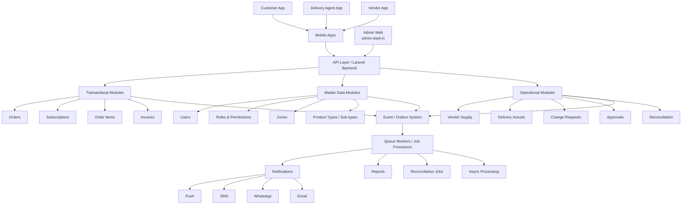
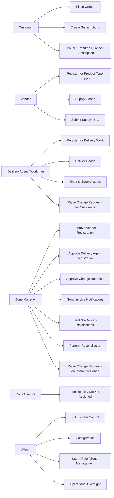
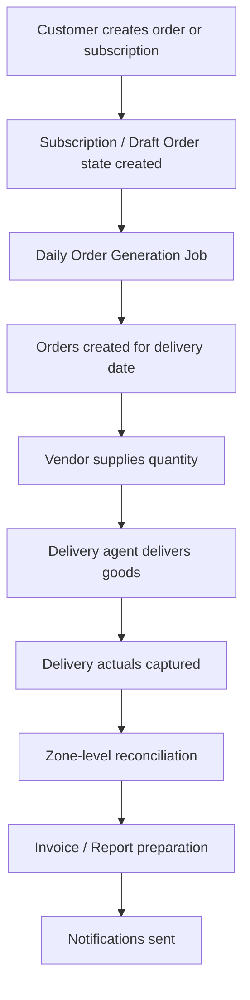
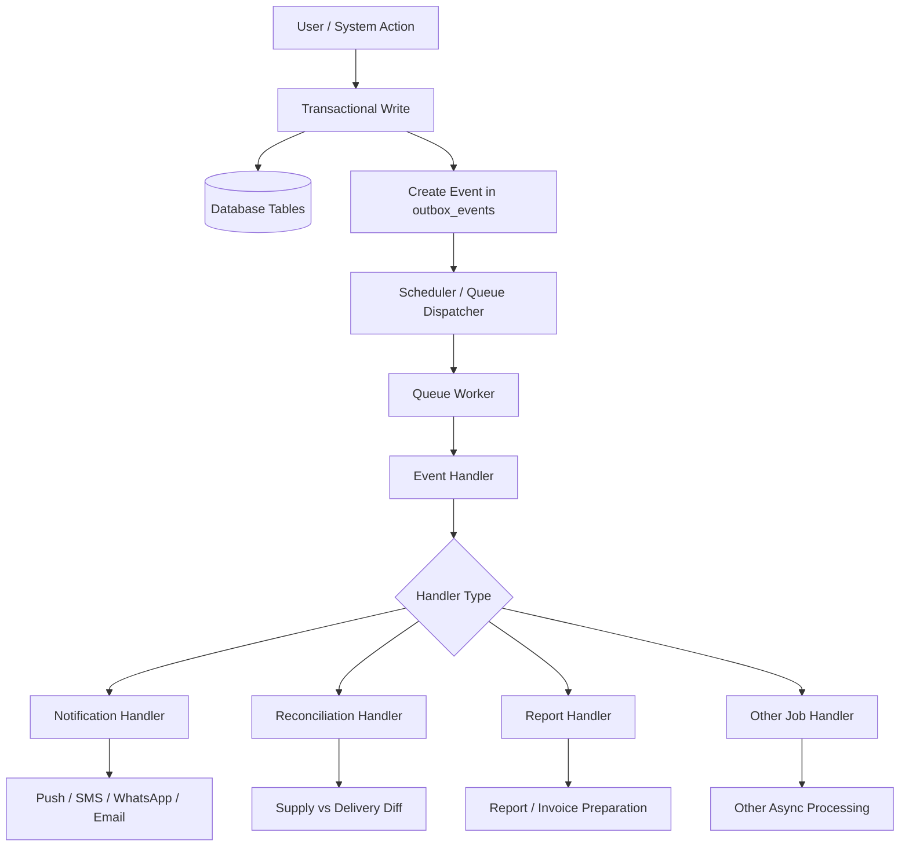
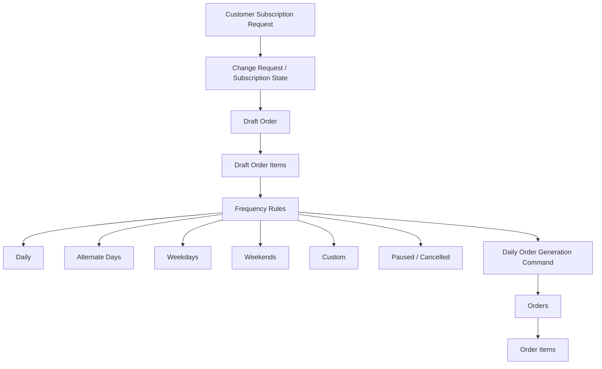
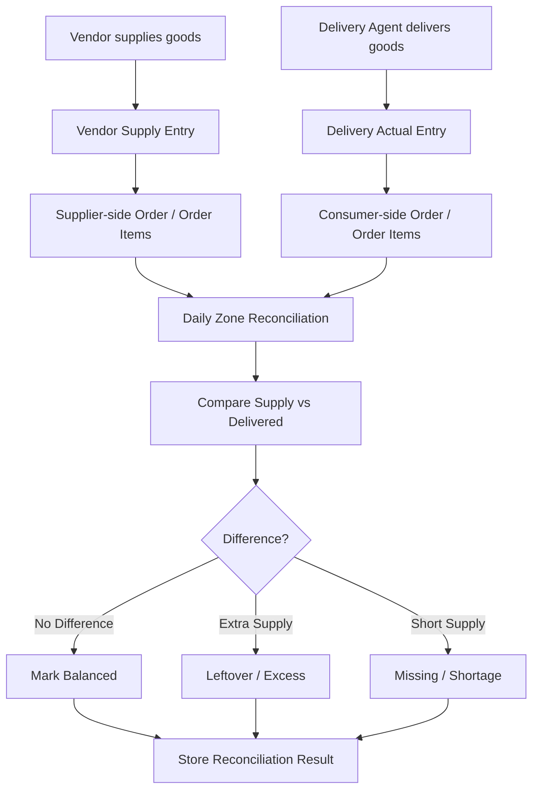
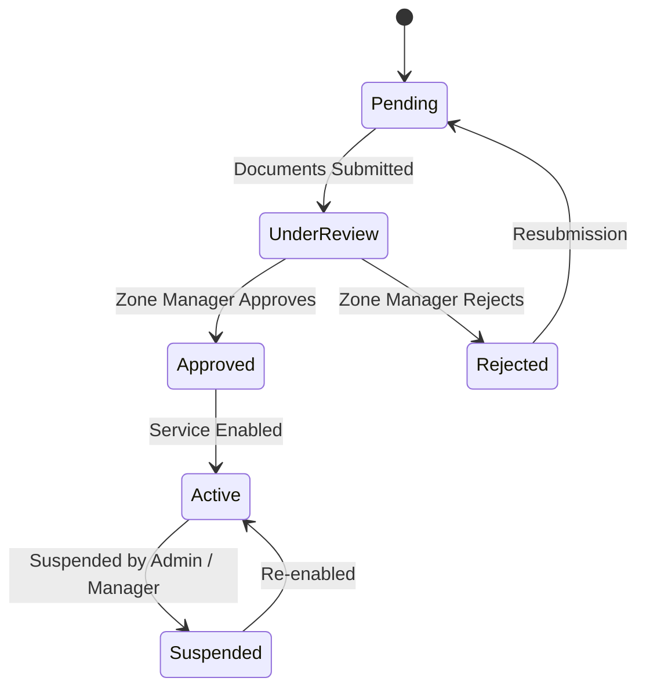
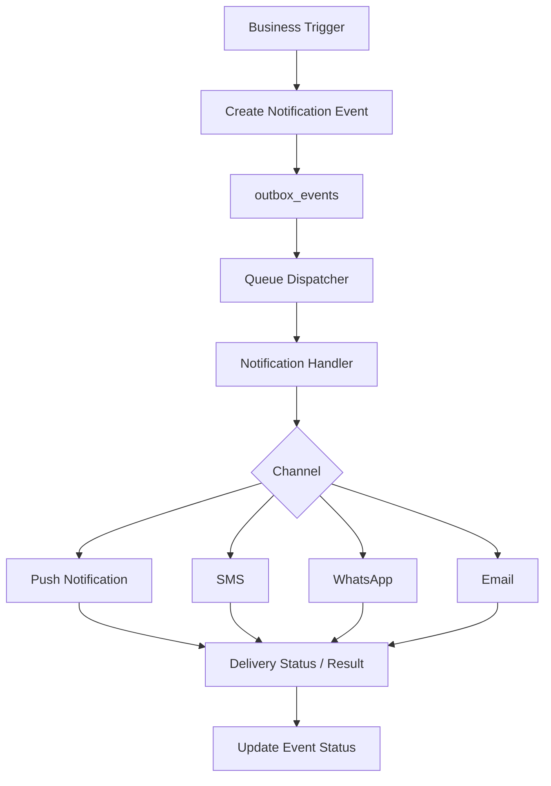
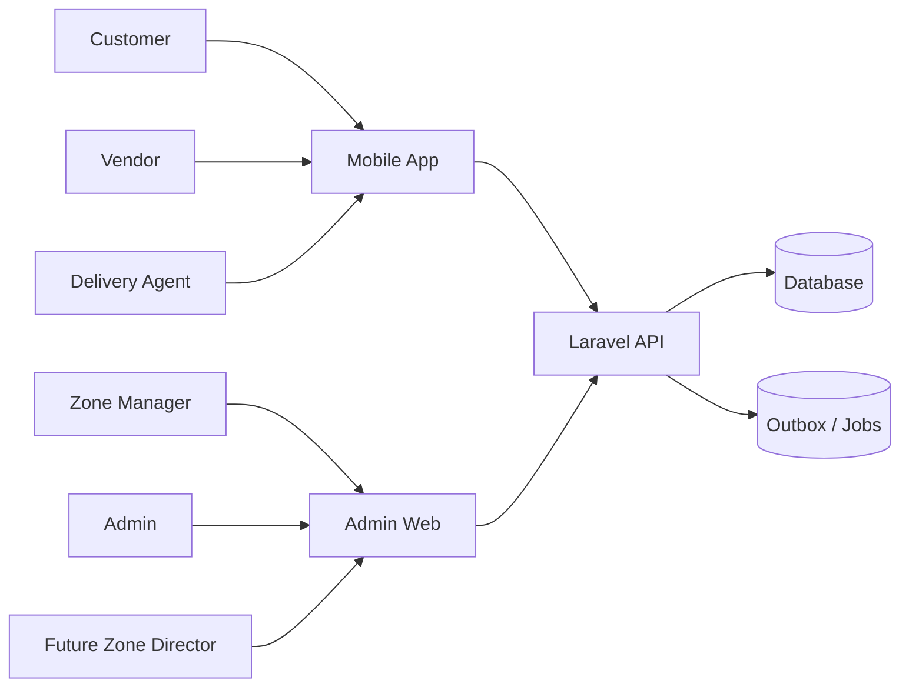

# Dayli Architecture & Functionality Documentation

## 1. Purpose of This Document

This document captures the technical architecture and functionality of the Dayli platform in a breadth-first, top-down manner.  
It is intended as a handover and reference document so that new technical team members can understand what has already been built and reuse existing components such as the notification mechanism, event-driven jobs, reconciliation flow, role-based access, and subscription/order processing.

---

## 2. High-Level Product View

Dayli is an e-commerce and delivery platform that supports:

- On-demand ordering
- Subscription-based recurring delivery
- Multiple product types and sub-types
- Role-based operational workflows
- Vendor supply capture
- Delivery actuals capture
- Change request handling
- Zone-level approvals and reconciliation
- Notifications and background jobs through an event-driven server-side mechanism

The platform serves both end users and internal operators through:

- Mobile application access
- Web admin access at `admin.dayli.in`
- Laravel backend API
- Database-backed transactional and event systems

---

## 3. Top-Level Architecture

---

## 4. Actor Responsibility Map

Dayli is a multi-actor system. Each actor has a specific operational responsibility.

---

## 5. Core Business Flow

This is the simplified end-to-end flow from customer demand to delivery, reconciliation, invoice, and notification.

---

## 6. Transactional vs Event-Driven Architecture

Dayli has two major backend layers:

1. **Transactional Layer**  
   Handles immediate business actions such as order creation, subscription updates, delivery actual entry, vendor supply entry, approvals, and change requests.

2. **Event-Driven Layer**  
   Handles asynchronous processing such as notifications, reconciliation jobs, report generation, retries, and background job execution.

---

## 7. Subscription and Order Generation Flow

Customers can either place immediate orders or subscribe to recurring delivery. Subscription state changes eventually affect daily order generation.

---

## 8. Vendor Supply, Delivery Actuals, and Reconciliation Flow

Vendor-side data represents supply. Delivery-side data represents actual delivered quantity. Reconciliation compares both sides.

---

## 9. Approval and Onboarding Flow

Vendors and delivery agents do not immediately become active. They go through a controlled onboarding and approval flow.

---

## 10. Notification Mechanism Overview

Notifications are not treated as direct inline actions only. They are generally handled through the event/job mechanism so that retries and failures can be tracked.

---

## 11. Access Channels

---

## 12. Documentation Drill-Down Plan

The remaining documentation should be expanded in the following order:

1. Actor and role model
2. Product type and sub-type model
3. Customer ordering flow
4. Subscription lifecycle flow
5. Daily order generation
6. Vendor onboarding and supply flow
7. Delivery agent onboarding and delivery flow
8. Delivery actuals
9. Change request mechanism
10. Zone manager workflows
11. Reconciliation logic
12. Invoice and report flow
13. Notification system
14. Event / outbox architecture
15. Queue worker and scheduler setup
16. Admin web functionality
17. Mobile app functionality
18. Database table mapping
19. API module mapping
20. Reusable components for future development

---

## 13. Current Known Scope Notes

- Dayli currently supports both on-demand and subscription-based delivery.
- The platform is structured around 16 product types with multiple sub-types.
- Customers, vendors, delivery agents, zone managers, zone directors, and admins exist as system roles.
- Zone director is currently present in the role hierarchy but does not yet have assigned functionality.
- Zone manager is central to approvals, reconciliation, notifications, and operational corrections.
- Admin has full control across the system.
- The backend contains a significant event-driven mechanism for notifications and job processing.
- Both mobile app and web admin interfaces use the backend API.

---

## 14. Next Section To Expand

Recommended next drill-down:

**Actor and Role Model**

This should document:

- Role hierarchy
- Role slugs
- User service approvals
- Vendor registration flow
- Delivery agent registration flow
- Customer permissions
- Zone manager permissions
- Admin permissions
