# Dayli Architecture & Functionality Documentation

## 1. Purpose of This Document

This document captures the technical architecture and functionality of the Dayli platform in a breadth-first, top-down manner.

It is intended as a handover and reference document so that new technical team members can understand what has already been built and reuse components such as order generation, reconciliation, notifications, and event-driven job processing.

---

## 2. High-Level Product View

Dayli is an e-commerce and delivery platform that supports:

- On-demand ordering
- Subscription-based recurring delivery
- Multiple product types and sub-types
- Role-based operational workflows
- Vendor supply capture
- Delivery actuals capture
- Change request handling
- Zone-level approvals and reconciliation
- Notifications and background jobs through an event-driven server-side mechanism

The platform serves users and internal operators through:

- Mobile application access
- Web admin access at `admin.dayli.in`
- Laravel backend API
- Database-backed transactional and event systems

---

## 3. Top-Level Architecture

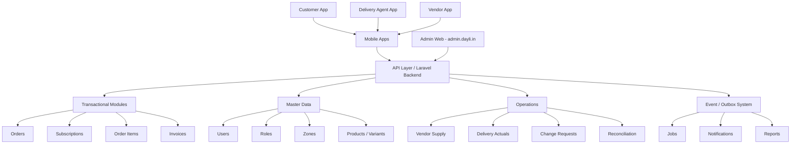

---

## 4. Actor Responsibility Map

```mermaid
flowchart TD
    C[Customer] --> C1[Place Order / Subscription]
    C --> C2[Pause / Resume / Cancel Subscription]

    V[Vendor] --> V1[Supply Goods by Product Type]
    V --> V2[Vendor Registration / Approval Flow]

    D[Delivery Agent] --> D1[Deliver Goods]
    D --> D2[Enter Delivery Actuals]
    D --> D3[Raise Change Requests for Customers]

    ZM[Zone Manager] --> ZM1[Approve Vendor / Delivery Agent]
    ZM --> ZM2[Approve Change Requests]
    ZM --> ZM3[Reconcile Supply vs Delivery]
    ZM --> ZM4[Send Invoice / No-Delivery Notifications]
    ZM --> ZM5[Raise Change Requests on Behalf of Customers]

    A[Admin] --> A1[Full System Control]

    ZD[Zone Director] --> ZD1[Functionality Not Yet Assigned]
```

---

# Orders & Subscription Engine

## 5. Core Concept

Dayli does not treat subscription delivery like a normal one-click e-commerce order.

For recurring delivery, the flow is:

```text
Subscription Intent
    ↓
Change Request / Subscription Request
    ↓
Draft Order
    ↓
Draft Order Items
    ↓
Daily Order Generation
    ↓
Orders
    ↓
Order Items
    ↓
Delivery / Reconciliation
```

Orders are materialized outputs generated from the subscription timeline.

---

## 6. Orders Data Model

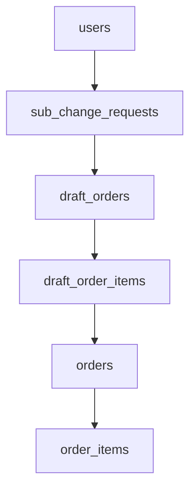

---

## 7. Subscription Lifecycle Flow

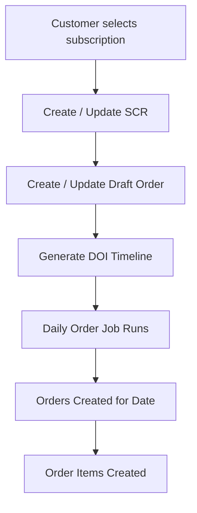

---

## 8. Subscription State Transitions

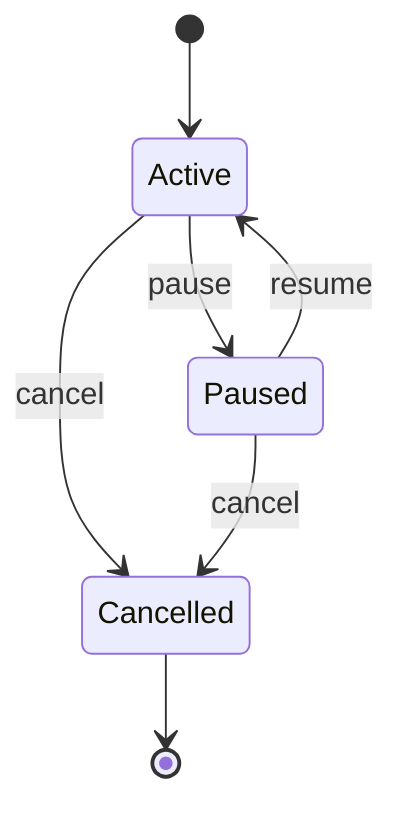

### State Meaning

| State | Meaning | Order Generation |
|---|---|---|
| Active | Subscription is currently running | Orders generated based on frequency |
| Paused | Temporarily stopped | No order generated during pause period |
| Cancelled | Permanently stopped | No future order generation |

### Important Rule

Subscription state changes should not destroy historical rows.

Dayli follows a timeline model:

```text
Old DOI is closed
New DOI is created
```

This preserves history and allows the system to answer:

- What was active on a given date?
- Why was an order generated or not generated?
- When did a pause or cancellation begin?
- Which change request caused the change?

---

## 9. Draft Order Items

Each `draft_order_items` row represents one subscription timeline segment.

Common fields:

- `draft_order_id`
- `product_id`
- `variant_id`
- `vendor_id`
- `frequency_type`
- `qty`
- `unit`
- `price_snapshot`
- `start_date`
- `end_date`
- `status`
- `supersedes_doi_id`
- `created_from_action`
- `meta`

---

## 10. Frequency Types

Common frequency types:

- `daily`
- `alternate_days`
- `weekdays`
- `weekends`
- `sat`
- `sun`
- `custom`
- `on_demand`

---

## 11. Order Generation Engine

Command:

```bash
php artisan dayli:generate-daily-orders --date=YYYY-MM-DD
```

Flow:

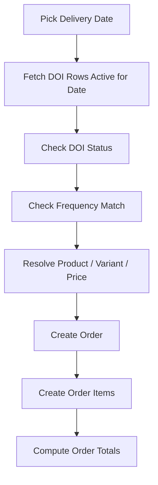

---

## 12. Order Snapshot Principle

An order stores the state at the time of generation.

Even if the product, variant, or price changes later, existing orders should remain historically correct.

Order items capture:

- Product
- Variant
- Quantity
- Unit price
- Line total
- Metadata

---

## 13. Price Resolution

Price should be resolved using `variant_price_history`.

Rule:

```text
effective_from <= order_date
AND
(effective_to IS NULL OR effective_to >= order_date)
```

This allows past orders to use old prices and future orders to use new prices.

---

# Reconciliation Deep Dive

## 14. Purpose of Reconciliation

Reconciliation compares what came into the zone from vendors against what went out to customers through delivery.

In simple terms:

```text
Vendor Supply IN
    minus
Customer Delivery OUT
    =
Difference
```

The difference tells the zone manager whether there is:

- Leftover stock
- Shortage
- Matching supply and delivery
- Possible data entry mismatch
- Missing vendor entry
- Missing delivery actual entry

---

## 15. Reconciliation Position in the System

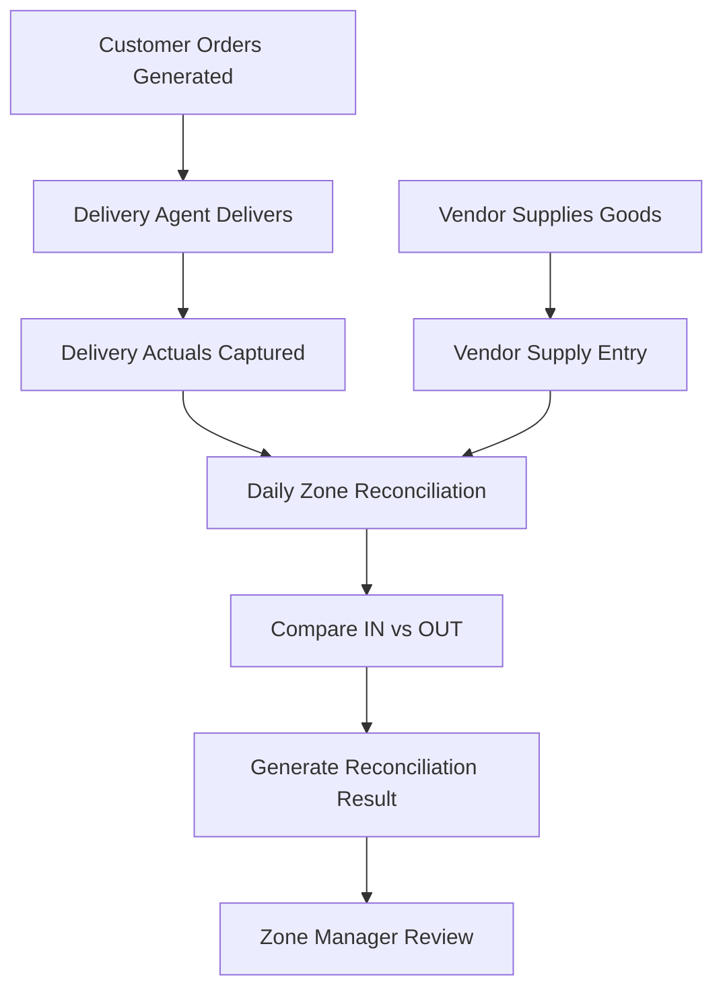

---

## 16. Reconciliation Actors

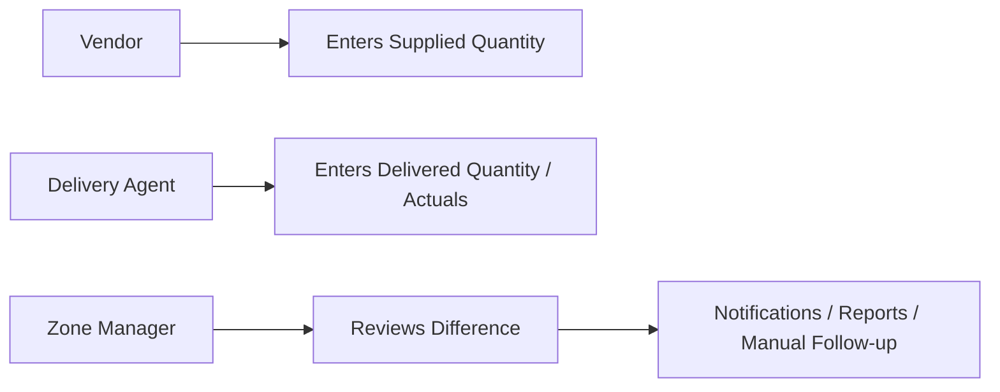

### Vendor Role

Vendor provides the supply-side quantity.

Example:

```text
Vijaya Gold Milk 500 ml: 35 packets supplied
Vijaya Toned Milk 500 ml: 8 packets supplied
```

### Delivery Agent Role

Delivery agent provides ground truth delivery data.

Example:

```text
Customer A received 1 packet
Customer B received 2 packets
Customer C paused today
```

### Zone Manager Role

Zone manager reviews mismatches and takes action:

- Approve / correct data
- Trigger notification
- Raise customer change request
- Investigate shortage
- Investigate excess stock
- Finalize daily reconciliation

---

## 17. Core Reconciliation Formula

```text
Difference = Supplied Quantity - Delivered Quantity
```

### Interpretation

| Difference | Meaning |
|---:|---|
| 0 | Supply and delivery match |
| Positive | Extra stock / leftover |
| Negative | Shortage / over-delivery / missing supply |
| Null / Missing | Data missing on one side |

---

## 18. Reconciliation Data Inputs

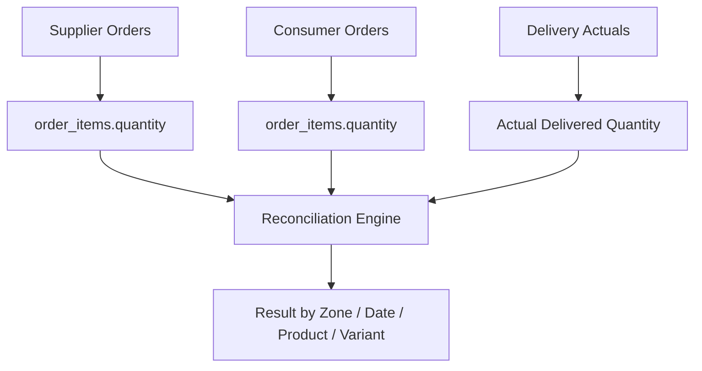

Main input sources:

- Vendor-side orders / supplier entries
- Customer-side orders
- Order items
- Delivery actuals
- Zone
- Delivery date
- Product / variant
- Subscription type

---

## 19. Reconciliation Scope

Reconciliation is usually performed by:

```text
zone_id
delivery_date
subscription_type_id
product_id / variant_id
```

Typical example:

```text
Zone: Sindhu Estate
Date: 2026-04-20
Subscription Type: Milk
Variant: Vijaya Gold Milk 500 ml
```

---

## 20. Supplier IN Side

Supplier IN represents quantity supplied into the zone.

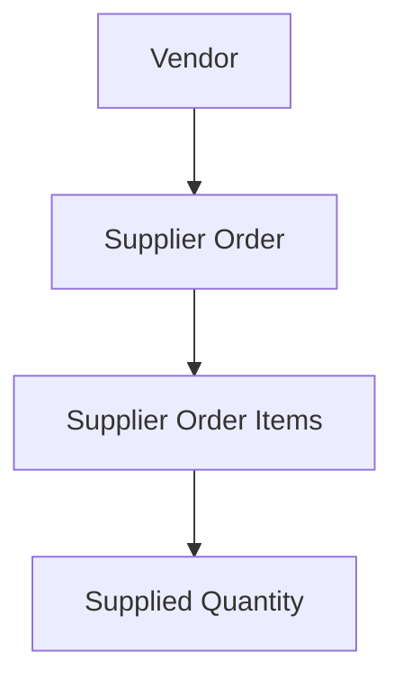

Conceptually:

```text
party_type = supplier
quantity = total quantity supplied by vendor
```

This may come from:

- Vendor mobile entry
- Zone manager entry
- Imported supplier sheet
- System-generated supplier order

---

## 21. Consumer OUT Side

Consumer OUT represents quantity that should be or was delivered to customers.

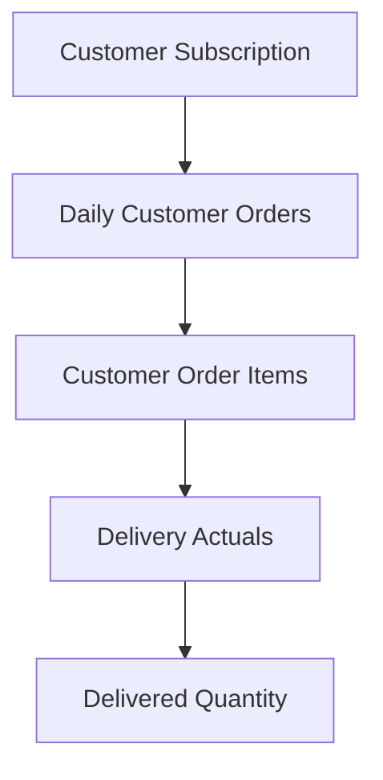

Conceptually:

```text
party_type = consumer
quantity = total quantity delivered / expected for customers
```

Depending on reconciliation mode, OUT can mean:

1. Expected quantity from generated customer orders
2. Actual delivered quantity entered by delivery agent

---

## 22. Expected vs Actual Reconciliation

There are two useful reconciliation levels.

### Level 1: Supply vs Expected Orders

```text
Supplied Quantity - Generated Customer Order Quantity
```

Used to check whether vendor supply is enough for planned delivery.

### Level 2: Supply vs Delivered Actuals

```text
Supplied Quantity - Actually Delivered Quantity
```

Used to check what really happened on the ground.

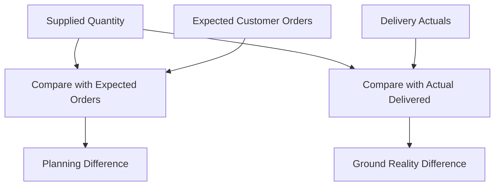

---

## 23. Reconciliation Result Examples

### Case 1: Perfect Match

```text
Vendor supplied: 100
Delivered: 100
Difference: 0
```

Result:

```text
Matched
```

---

### Case 2: Leftover

```text
Vendor supplied: 120
Delivered: 100
Difference: +20
```

Result:

```text
20 units leftover
```

---

### Case 3: Shortage

```text
Vendor supplied: 90
Delivered: 100
Difference: -10
```

Result:

```text
10 units shortage
```

---

### Case 4: Missing Vendor Entry

```text
Vendor supplied: null
Delivered: 100
Difference: cannot compute
```

Result:

```text
Vendor supply missing
```

---

### Case 5: Missing Delivery Actual

```text
Vendor supplied: 100
Delivered actual: null
Expected: 100
```

Result:

```text
Delivery actuals missing
```

---

## 24. Event-Driven Reconciliation Trigger

Reconciliation is not only a manual screen operation. It can also be triggered by backend events.

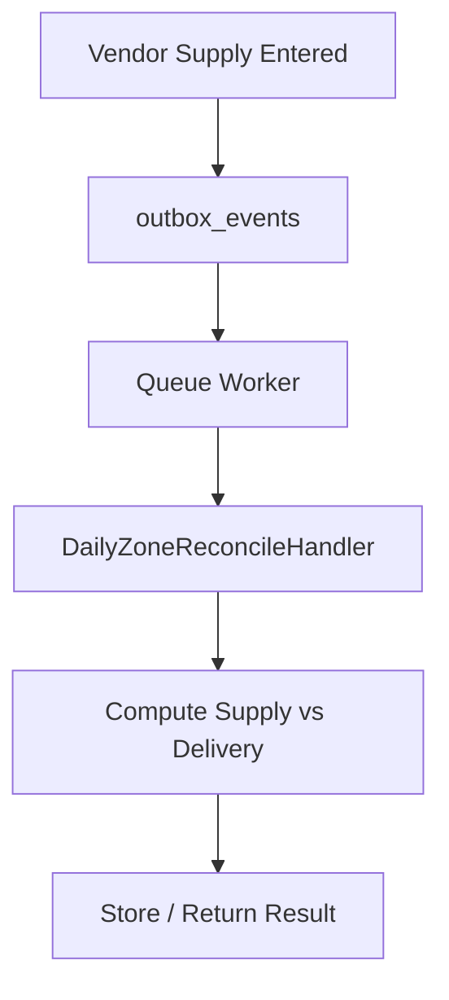

Important event types:

```text
vendor_supply_entered
zone.daily.reconcile
recon.daily_zone
daily_zone_reconcile
```

Handler:

```text
DailyZoneReconcileHandler
```

---

## 25. Outbox-Based Reconciliation Flow

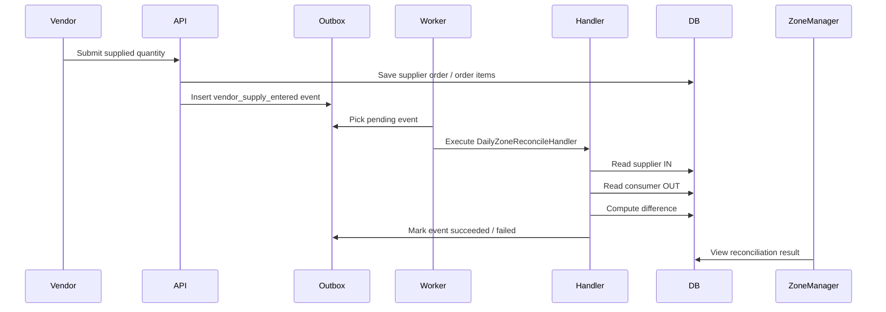

---

## 26. Reconciliation Handler Responsibilities

The reconciliation handler should:

1. Receive event payload
2. Identify zone, date, and subscription type
3. Fetch supplier-side quantities
4. Fetch consumer-side quantities
5. Group by product / variant
6. Compute difference
7. Return structured result
8. Mark outbox event as succeeded or failed

---

## 27. Typical Event Payload

```json
{
  "zone_id": 1,
  "delivery_date": "2026-04-20",
  "subscription_type_id": 3,
  "order_id": 12345,
  "vendor_id": 99,
  "delivered_only": true
}
```

Field meaning:

| Field | Meaning |
|---|---|
| zone_id | Zone being reconciled |
| delivery_date | Date of supply / delivery |
| subscription_type_id | Product category/service type |
| order_id | Related vendor/customer order if available |
| vendor_id | Vendor who supplied goods |
| delivered_only | Whether to count only delivered orders |

---

## 28. Reconciliation Output Shape

Expected output should be structured like this:

```json
{
  "zone_id": 1,
  "delivery_date": "2026-04-20",
  "subscription_type_id": 3,
  "items": [
    {
      "product_id": 10,
      "variant_id": 101,
      "title": "Vijaya Gold Milk 500 ml",
      "supplied_qty": 120,
      "expected_qty": 118,
      "delivered_qty": 115,
      "diff_vs_expected": 2,
      "diff_vs_delivered": 5,
      "status": "leftover"
    }
  ]
}
```

---

## 29. Reconciliation Status Classification

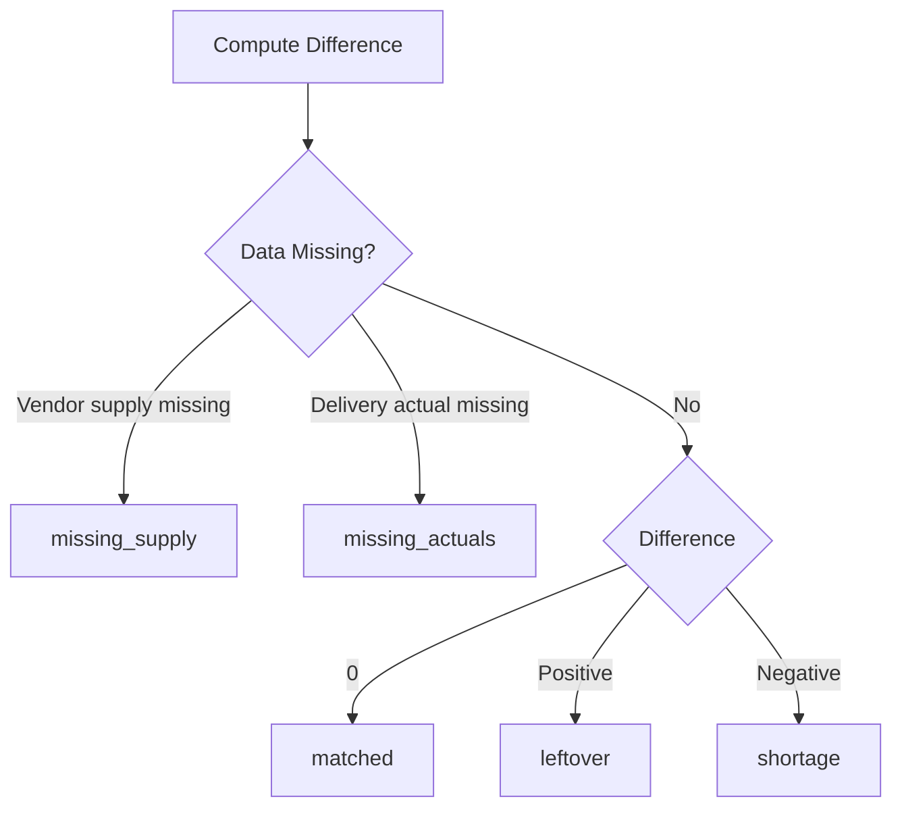

Suggested statuses:

| Status | Meaning |
|---|---|
| matched | Supply and delivery matched |
| leftover | Supplied quantity is greater than delivered |
| shortage | Delivered quantity is greater than supplied |
| missing_supply | Vendor supply entry missing |
| missing_actuals | Delivery actuals missing |
| pending_review | Needs zone manager review |
| approved | Zone manager approved result |

---

## 30. Zone Manager Reconciliation Workflow

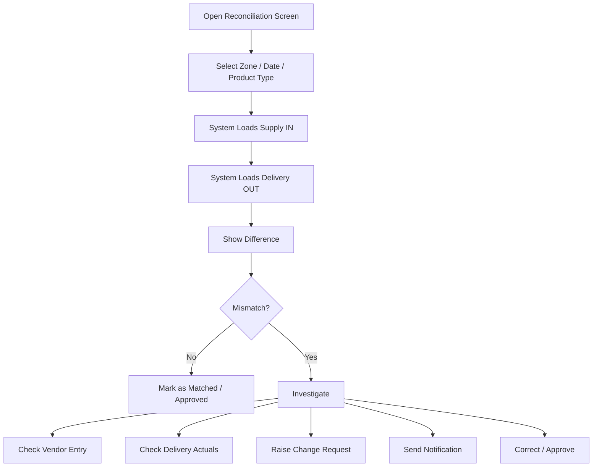

---

## 31. Relation with Notifications

Reconciliation can trigger notifications such as:

- Vendor supply missing notification
- Delivery actuals missing notification
- Customer no-delivery notification
- Invoice notification
- Zone manager alert
- Admin escalation alert

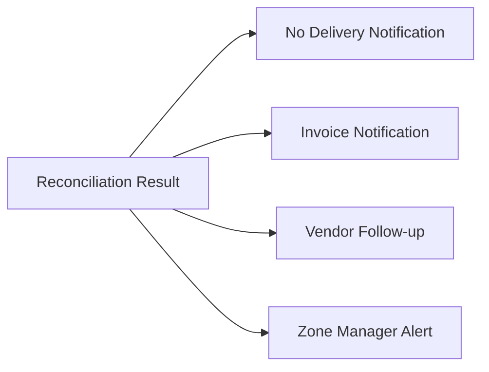

---

## 32. Relation with Invoices

Reconciliation should happen before final billing where possible.

Reason:

```text
Invoices should reflect what was actually delivered, not merely what was planned.
```

Flow:

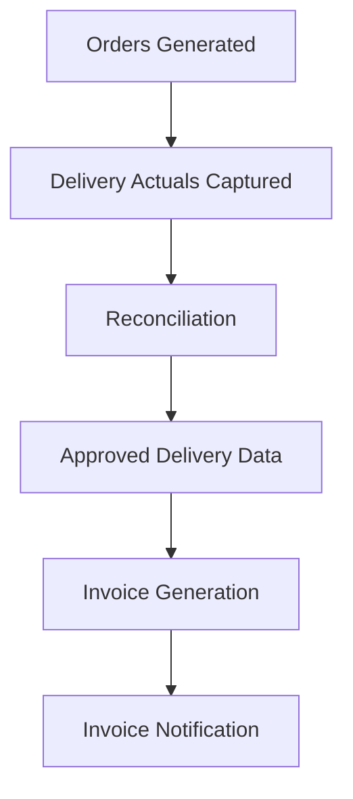

---

## 33. Common Failure Cases

| Case | Cause | Action |
|---|---|---|
| Vendor supply missing | Vendor did not enter data | Notify vendor / zone manager |
| Delivery actual missing | Delivery agent did not update actuals | Notify delivery agent |
| Negative difference | Delivered more than supplied | Check supply entry or delivery entry |
| Positive difference | Extra supplied stock | Track leftover / wastage / carry-forward |
| Wrong product mapping | Variant mismatch | Correct product/variant mapping |
| Wrong date | Supply or delivery entered against wrong date | Correct date / regenerate report |

---

## 34. Important Design Rules

### 1. Reconciliation should be date-bound

Always reconcile for a specific delivery date.

### 2. Reconciliation should be zone-bound

Supply and delivery must be compared inside the same zone.

### 3. Reconciliation should be variant-aware

Do not compare only at product type level.

Example:

```text
Milk total = 100
```

is not enough.

Need:

```text
Vijaya Gold Milk 500 ml = 40
Vijaya Toned Milk 500 ml = 50
Curd 500 ml = 10
```

### 4. Actuals should override expectation for final settlement

Generated order quantity is planned quantity.

Delivery actual is ground truth.

### 5. Event processing should be idempotent

Running reconciliation multiple times for the same zone/date should not corrupt data.

---

## 35. Reconciliation Summary

Reconciliation is the operational bridge between:

```text
Vendor supply
Customer demand
Delivery execution
Billing
Notifications
```

It ensures that Dayli can answer:

- What was supposed to be delivered?
- What was actually supplied?
- What was actually delivered?
- Is there shortage or leftover?
- Who needs to act?
- Can invoice generation proceed?

---


---

# Event / Outbox System Deep Dive

## 36. Purpose of the Event System

Dayli has many actions that should not be tightly coupled to the main user request.

Example:

```text
Vendor enters supply
    ↓
Reconciliation should run
    ↓
Notification may be sent
    ↓
Report may be updated
```

These follow-up actions should not block the API response.

So Dayli uses an event-driven backend mechanism based on an `outbox_events` table.

---

## 37. Why Outbox Exists

Without outbox:

```text
API request
    ↓
Save transaction
    ↓
Send notification
    ↓
Run reconciliation
    ↓
Generate report
    ↓
Return response
```

This is risky because:

- API becomes slow
- Failure in notification can break business flow
- Retry handling becomes messy
- Long jobs may timeout
- No audit trail for background actions

With outbox:

```text
API request
    ↓
Save transaction
    ↓
Insert event into outbox_events
    ↓
Return response

Worker later:
    ↓
Pick event
    ↓
Process handler
    ↓
Mark success / failure
```

---

## 38. High-Level Event Flow

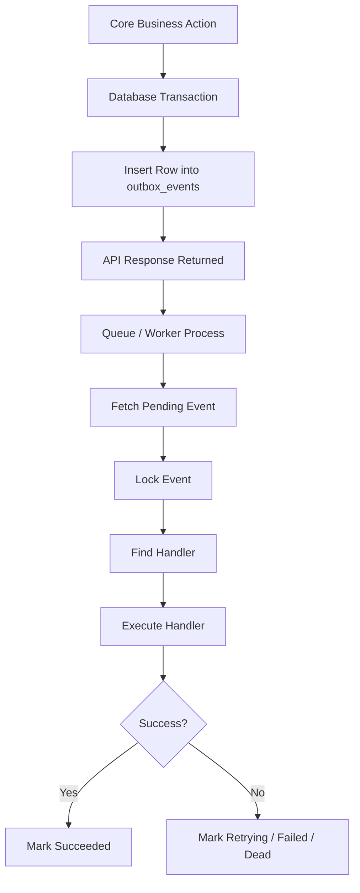

---

## 39. Outbox Table Concept

The `outbox_events` table acts as a durable queue.

It stores:

- What happened
- Which entity it relates to
- What handler should process it
- Payload required for processing
- Current processing status
- Retry count
- Error result if failed

---

## 40. Typical outbox_events Fields

```text
id
event_type
aggregate_type
aggregate_id
correlation_id
idempotency_key
payload
result
status
priority
attempts
max_attempts
scheduled_at
locked_at
locked_by
processed_at
created_at
updated_at
```

---

## 41. Event Status Lifecycle

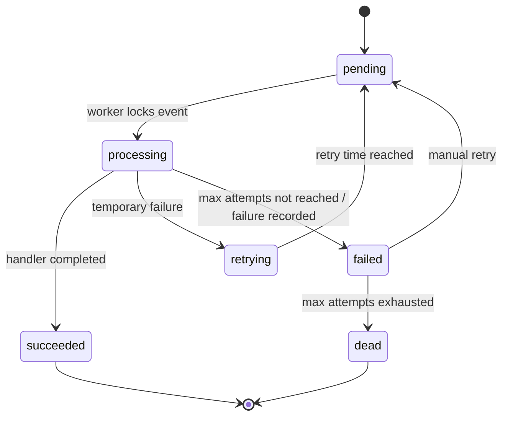

---

## 42. Status Meaning

| Status | Meaning |
|---|---|
| pending | Event is waiting to be processed |
| processing | Worker has picked and locked the event |
| retrying | Event failed but can be retried |
| succeeded | Handler completed successfully |
| failed | Handler failed and needs review / retry |
| dead | Event exhausted retries and should not auto-run |

---

## 43. Event Creation Pattern

Business code should not directly run long background logic.

Instead, it should create an event.

Example:

```text
Vendor supply submitted
    ↓
Save supplier order
    ↓
Save supplier order items
    ↓
Create outbox event: vendor_supply_entered
```

```mermaid
sequenceDiagram
    participant API
    participant DB
    participant Outbox

    API->>DB: Save core business data
    API->>Outbox: Insert event row
    API-->>API: Return response to caller
```

---

## 44. Event Handler Registry

Dayli uses a handler registry concept.

The registry maps:

```text
event_type → handler class
```

Example:

```text
vendor_supply_entered → DailyZoneReconcileHandler
zone.daily.reconcile → DailyZoneReconcileHandler
recon.daily_zone → DailyZoneReconcileHandler
daily_zone_reconcile → DailyZoneReconcileHandler
```

This keeps event dispatching generic.

The worker does not need to know the business meaning of each event.

It only needs to:

```text
read event_type
find handler
execute handler
```

---

## 45. Handler Dispatch Flow

```mermaid
flowchart TD
    A[Worker Picks Event] --> B[Read event_type]
    B --> C[EventHandlerRegistry]
    C --> D{Handler Found?}

    D -->|Yes| E[Execute Handler]
    D -->|No| F[Fail Event: No Handler Registered]

    E --> G{Handler Success?}
    G -->|Yes| H[Mark Event Succeeded]
    G -->|No| I[Retry / Fail / Dead]
```

---

## 46. Example: Vendor Supply Entered

When vendor supply is entered, reconciliation should run.

```mermaid
sequenceDiagram
    participant Vendor
    participant API
    participant DB
    participant Outbox
    participant Worker
    participant Handler

    Vendor->>API: Enter supply quantity
    API->>DB: Save supplier order + order items
    API->>Outbox: Insert vendor_supply_entered event
    API-->>Vendor: Success response

    Worker->>Outbox: Pick pending event
    Worker->>Handler: Execute DailyZoneReconcileHandler
    Handler->>DB: Read supply IN and delivery OUT
    Handler->>DB: Compute reconciliation
    Handler->>Outbox: Store result and mark succeeded
```

---

## 47. Example Event Payload

```json
{
  "zone_id": 1,
  "delivery_date": "2026-04-20",
  "subscription_type_id": 3,
  "vendor_id": 99,
  "order_id": 12345,
  "delivered_only": true
}
```

This payload gives the handler enough context to process the event without depending on the original API request.

---

## 48. Correlation ID

`correlation_id` links multiple related events or actions together.

Example:

```text
Customer change request
    ↓
Order regeneration
    ↓
Notification
    ↓
Invoice update
```

All of these can share the same `correlation_id`.

This helps debugging.

---

## 49. Idempotency Key

`idempotency_key` prevents duplicate processing.

Example:

```text
reconcile:zone:1:date:2026-04-20:type:3
```

If the same event is inserted twice accidentally, the system can identify and avoid duplicate side effects.

---

## 50. Scheduled Events

Not every event must run immediately.

`scheduled_at` allows deferred execution.

Example uses:

- Send notification later
- Run reconciliation after delivery window closes
- Generate invoice after month end
- Retry failed event after delay

```mermaid
flowchart TD
    A[Event Created] --> B{scheduled_at <= now?}
    B -->|Yes| C[Worker Can Pick]
    B -->|No| D[Wait]
    D --> B
```

---

## 51. Retry Strategy

When a handler fails, the system should decide whether the failure is temporary or permanent.

Temporary failures:

- External notification provider down
- Network failure
- DB lock timeout
- Queue worker crash

Permanent failures:

- Invalid payload
- Missing required entity
- No handler registered
- Product mapping invalid

```mermaid
flowchart TD
    A[Handler Fails] --> B{Can Retry?}
    B -->|Yes| C[Increment Attempts]
    C --> D[Set Status retrying]
    D --> E[Set Next scheduled_at]

    B -->|No| F[Set Status failed / dead]
```

---

## 52. Worker Responsibilities

The worker is responsible for:

1. Finding pending events
2. Locking an event before processing
3. Avoiding duplicate workers processing the same event
4. Calling the correct handler
5. Saving result
6. Updating attempts
7. Marking success or failure
8. Releasing or extending locks when needed

---

## 53. Locking Concept

Locking avoids duplicate processing.

```text
Worker A picks event #10
    ↓
sets locked_at and locked_by
    ↓
Worker B should not process event #10
```

If Worker A crashes, the lock can be considered expired after a configured time.

---

## 54. Event Processing Sequence

```mermaid
sequenceDiagram
    participant Scheduler
    participant Worker
    participant Outbox
    participant Registry
    participant Handler

    Scheduler->>Worker: Run dispatch command
    Worker->>Outbox: Fetch pending due event
    Worker->>Outbox: Lock event
    Worker->>Registry: Resolve handler by event_type
    Registry-->>Worker: Handler class
    Worker->>Handler: Execute payload
    Handler-->>Worker: Result
    Worker->>Outbox: Update status/result
```

---

## 55. Artisan / Scheduler Layer

The event system can be driven by Laravel scheduler and queue workers.

Known operational commands:

```bash
php artisan schedule:list
php artisan schedule:run
php artisan queue:work --queue=ops,default -v
```

Known scheduled command:

```text
php artisan ops:dispatch-due
```

This command dispatches due outbox events.

---

## 56. Event System and Notifications

Notifications should be treated as event side effects.

Example:

```text
invoice.generated
    ↓
Send invoice notification
```

or

```text
no_delivery.detected
    ↓
Send no-delivery notification
```

```mermaid
flowchart TD
    A[Business Event] --> B[outbox_events]
    B --> C[Notification Handler]
    C --> D[Push / SMS / WhatsApp / Email]
    D --> E[Notification Result Stored]
```

---

## 57. Event System and Reconciliation

Reconciliation is one of the major uses of the event system.

Example:

```text
vendor_supply_entered
    ↓
DailyZoneReconcileHandler
    ↓
supply vs delivery comparison
```

This lets reconciliation happen automatically after operational data is entered.

---

## 58. Event System and Reports

Reports can also be queued.

Example:

```text
monthly_invoice_report.requested
    ↓
Report generation handler
    ↓
outbox_reports updated
```

This avoids slow report generation inside a browser request.

---

## 59. Event Categories

Suggested event categories:

| Category | Example |
|---|---|
| Reconciliation | `vendor_supply_entered`, `zone.daily.reconcile` |
| Notification | `invoice.notification.requested`, `no_delivery.notification.requested` |
| Reporting | `monthly_invoice_report.requested` |
| Subscription | `subscription.changed`, `subscription.paused`, `subscription.cancelled` |
| Order | `daily_orders.generated`, `order.created` |
| Approval | `vendor.approved`, `delivery_agent.approved` |

---

## 60. Event Naming Rule

Use consistent naming.

Recommended format:

```text
domain.action
```

Examples:

```text
zone.daily.reconcile
invoice.notification.send
subscription.pause.requested
vendor.supply.entered
delivery.actuals.submitted
```

Avoid mixing too many styles unless backward compatibility is required.

---

## 61. Handler Design Rule

Each handler should do one clear job.

Good:

```text
DailyZoneReconcileHandler
SendInvoiceNotificationHandler
GenerateMonthlyInvoiceReportHandler
```

Bad:

```text
DoEverythingAfterOrderHandler
```

---

## 62. Handler Input / Output Rule

A handler should receive:

```text
payload
event metadata
```

A handler should return:

```text
structured result
```

Example result:

```json
{
  "status": "matched",
  "zone_id": 1,
  "delivery_date": "2026-04-20",
  "items_checked": 8,
  "mismatches": 0
}
```

---

## 63. Error Result Shape

When a handler fails, store useful error information.

```json
{
  "error": "No handler registered",
  "event_type": "unknown.event",
  "failed_at": "2026-04-20 10:15:00"
}
```

Useful error result helps debugging without digging through logs only.

---

## 64. Idempotent Handler Rule

Handlers must be safe to run more than once.

Reason:

- Worker may crash after doing work but before marking succeeded
- Event may be retried
- Manual retry may happen
- Same event may be inserted accidentally

A handler should use:

- idempotency key
- unique constraints
- update-or-create logic
- safe status checks

---

## 65. Transaction Boundary

Core business transaction and outbox insert should ideally happen together.

Example:

```text
DB transaction starts
    ↓
save vendor supply
    ↓
insert outbox event
    ↓
commit
```

This avoids a dangerous situation:

```text
Supply saved but event not created
```

or

```text
Event created but supply not saved
```

---

## 66. Manual Retry / Admin Review

Admin or technical operator should be able to inspect failed events.

Useful filters:

- status = failed
- status = dead
- event_type
- delivery_date
- zone_id
- created_at
- attempts

Manual actions:

- retry
- mark dead
- inspect payload
- inspect result
- correct payload and requeue if needed

---

## 67. Operational Debugging Flow

```mermaid
flowchart TD
    A[Something did not happen] --> B[Check outbox_events]
    B --> C{Event exists?}

    C -->|No| D[Problem in business code: event not inserted]
    C -->|Yes| E{Status?}

    E -->|pending| F[Worker / scheduler not running]
    E -->|processing| G[Check lock / stuck worker]
    E -->|retrying| H[Check attempts and next scheduled_at]
    E -->|failed| I[Check result / exception]
    E -->|dead| J[Max retries exhausted]
    E -->|succeeded| K[Check handler result / downstream data]
```

---

## 68. Common Failure Cases

| Problem | Likely Cause | Where to Check |
|---|---|---|
| Reconciliation did not run | Event not created or worker stopped | `outbox_events`, scheduler |
| Event stuck pending | `ops:dispatch-due` not running | cron / schedule |
| Event stuck processing | Worker crashed after lock | `locked_at`, `locked_by` |
| Event failed | Handler exception | `result`, Laravel logs |
| No handler registered | Registry missing mapping | EventHandlerRegistry |
| Duplicate side effects | Handler not idempotent | idempotency key / unique constraints |

---

## 69. Relationship with Laravel Scheduler

Laravel scheduler triggers the outbox dispatch command.

```mermaid
flowchart LR
    A[System Cron] --> B[php artisan schedule:run]
    B --> C[Laravel Scheduler]
    C --> D[ops:dispatch-due]
    D --> E[outbox_events]
    E --> F[Handlers]
```

If cron is not configured correctly, due events may remain pending.

---

## 70. Relationship with Laravel Queue

For heavier workloads, the dispatcher can push jobs into Laravel queues.

```mermaid
flowchart TD
    A[ops:dispatch-due] --> B[Pick Due Event]
    B --> C[Dispatch Laravel Job]
    C --> D[queue:work ops,default]
    D --> E[Execute Handler]
```

This separates event discovery from actual work execution.

---

## 71. Event System Summary

The event/outbox system is the backbone for Dayli’s asynchronous backend work.

It enables:

- Reliable notifications
- Automatic reconciliation
- Background report generation
- Retryable jobs
- Auditable processing
- Decoupled business modules

Core rule:

```text
Transactional modules create events.
Workers process events.
Handlers perform side effects.
Results are stored back for traceability.
```

---


---

# Notifications System Deep Dive

## 72. Purpose of the Notification System

Dayli uses notifications to communicate operational and transactional updates to different actors.

Notifications are not just marketing messages.

They are part of the operating system of Dayli.

Examples:

```text
Customer invoice generated
Delivery not happening today
Vendor supply missing
Delivery actuals missing
Zone manager needs to approve something
Customer subscription changed
```

The notification system should support:

- Push notifications
- SMS
- WhatsApp
- Email
- In-app notifications
- Admin-triggered broadcast notifications

---

## 73. Notification Position in Architecture

```mermaid
flowchart TD
    A[Business Event] --> B[outbox_events]
    B --> C[Notification Handler]
    C --> D[Notification Service Layer]

    D --> P[Push Notification / FCM]
    D --> S[SMS Provider]
    D --> W[WhatsApp Provider]
    D --> E[Email Provider]
    D --> I[In-App Notification Table]

    C --> R[Store Result / Failure]
```

Notifications are normally triggered through the event/outbox system.

This prevents the main business action from failing only because a notification provider failed.

---

## 74. Why Notifications Should Be Event-Driven

Bad pattern:

```text
Customer action
    ↓
Update database
    ↓
Send SMS immediately
    ↓
Send WhatsApp immediately
    ↓
Send push immediately
    ↓
Return response
```

Problems:

- API becomes slow
- Provider failure breaks user action
- No retry
- No audit trail
- Hard to debug

Good pattern:

```text
Customer action
    ↓
Update database
    ↓
Insert notification event
    ↓
Return response

Worker later:
    ↓
Send notification
    ↓
Store result
```

---

## 75. Notification Flow

```mermaid
sequenceDiagram
    participant Module as Business Module
    participant Outbox
    participant Worker
    participant Handler as Notification Handler
    participant Service as Notification Service
    participant Provider
    participant DB

    Module->>Outbox: Insert notification event
    Worker->>Outbox: Pick pending event
    Worker->>Handler: Execute notification handler
    Handler->>Service: Build message and channel
    Service->>Provider: Send message
    Provider-->>Service: Provider response
    Service->>DB: Store notification result
    Handler->>Outbox: Mark event succeeded / failed
```

---

## 76. Notification Types

Dayli may have several notification categories.

| Category | Example |
|---|---|
| Transactional | Order placed, subscription changed |
| Operational | Vendor supply missing, delivery actuals missing |
| Billing | Invoice generated, payment reminder |
| Delivery | No delivery today, delivery completed |
| Approval | Vendor approved, delivery agent approved |
| Admin Broadcast | Message sent by admin / zone manager |
| System Alert | Job failed, reconciliation mismatch |

---

## 77. Notification Recipients

Notifications may be sent to different actors.

```mermaid
flowchart TD
    N[Notification System] --> C[Customer]
    N --> V[Vendor]
    N --> D[Delivery Agent]
    N --> ZM[Zone Manager]
    N --> A[Admin]
```

Examples:

| Recipient | Notification Example |
|---|---|
| Customer | Invoice ready, subscription paused, no delivery today |
| Vendor | Supply entry pending, supply mismatch |
| Delivery Agent | Delivery actuals pending |
| Zone Manager | Mismatch found, approval pending |
| Admin | Failed event, system issue, escalation |

---

## 78. Notification Channels

Dayli should treat notification channel as separate from notification intent.

Same notification can be sent through different channels.

```mermaid
flowchart LR
    I[Notification Intent] --> C1[Push]
    I --> C2[SMS]
    I --> C3[WhatsApp]
    I --> C4[Email]
    I --> C5[In-App]
```

Example:

```text
invoice_generated
    → Push to customer
    → WhatsApp to customer
    → In-app notification
```

---

## 79. Channel Selection Logic

Channel selection can depend on:

- User role
- User preference
- Message importance
- Availability of phone/email/device token
- Cost
- Urgency
- Regulatory constraints
- Provider availability

Example:

```mermaid
flowchart TD
    A[Notification Request] --> B{User has device token?}
    B -->|Yes| P[Send Push]
    B -->|No| C{Has mobile number?}

    C -->|Yes| W[Send WhatsApp / SMS]
    C -->|No| E{Has email?}

    E -->|Yes| M[Send Email]
    E -->|No| F[Mark Failed: No Reachable Channel]
```

---

## 80. Core Notification Components

Suggested logical components:

```text
NotificationController
NotificationService
PushNotificationService
SmsNotificationService
WhatsAppNotificationService
EmailNotificationService
NotificationTemplateService
NotificationPreferenceService
NotificationLog
```

---

## 81. Push Notification Pipeline

Dayli uses Firebase Cloud Messaging conceptually for push notifications.

```mermaid
flowchart TD
    A[User Logs In] --> B[Mobile App Gets FCM Token]
    B --> C[POST /api/device-tokens]
    C --> D[Save device_tokens Row]

    E[Notification Event] --> F[Push Service]
    F --> G[Fetch User Device Tokens]
    G --> H[Send to FCM]
    H --> I[Store Result]
```

---

## 82. Device Token Registration

Mobile app should register the device token after login.

Typical endpoint:

```text
POST /api/device-tokens
```

Typical payload:

```json
{
  "token": "fcm_device_token",
  "platform": "android",
  "device_id": "device_unique_id",
  "app_version": "1.0.0"
}
```

The backend stores:

```text
user_id
token
platform
device_id
app_version
is_valid
last_seen_at
```

---

## 83. Device Token Table

Conceptual table:

```text
device_tokens
```

Important fields:

```text
id
user_id
token
platform
device_id
app_version
is_valid
last_seen_at
created_at
updated_at
```

---

## 84. Push Notification Send Flow

```mermaid
sequenceDiagram
    participant Handler
    participant PushService
    participant DB
    participant FCM
    participant Device

    Handler->>PushService: sendToUser(user_id, title, body, data)
    PushService->>DB: Fetch valid device tokens
    PushService->>FCM: Send payload
    FCM-->>Device: Push notification
    FCM-->>PushService: Response
    PushService->>DB: Save result / invalidate bad token
```

---

## 85. Push Notification Payload

Suggested shape:

```json
{
  "title": "Invoice Ready",
  "body": "Your milk invoice for April is ready.",
  "data": {
    "type": "invoice",
    "invoice_id": "123",
    "screen": "invoice_detail"
  }
}
```

The `data` block is important because the mobile app can use it for navigation.

---

## 86. In-App Notifications

In-app notifications are database records shown inside the app or admin web.

They are useful even if push/SMS/WhatsApp fails.

Conceptual table:

```text
notifications
```

Typical fields:

```text
id
user_id
title
body
type
data
read_at
created_at
updated_at
```

---

## 87. In-App Notification Flow

```mermaid
flowchart TD
    A[Notification Event] --> B[Create notifications Row]
    B --> C[User Opens App]
    C --> D[Fetch Notifications]
    D --> E[Mark as Read]
```

In-app notification should be considered the internal source of truth for user-visible alerts.

External channels are delivery mechanisms.

---

## 88. SMS Notification Pipeline

SMS is useful for users who do not actively use the app.

```mermaid
flowchart TD
    A[Notification Event] --> B[SMS Handler]
    B --> C[Resolve Mobile Number]
    C --> D[Build SMS Template]
    D --> E[Send via SMS Provider]
    E --> F[Store Provider Response]
```

Common use cases:

- OTP
- Invoice alert
- No delivery alert
- Critical service message

---

## 89. WhatsApp Notification Pipeline

WhatsApp is useful for Indian customers and business users who may not use email.

```mermaid
flowchart TD
    A[Notification Event] --> B[WhatsApp Handler]
    B --> C[Resolve Mobile Number]
    C --> D[Resolve Approved Template]
    D --> E[Send via WhatsApp Provider]
    E --> F[Store Result]
```

WhatsApp messages should generally use approved templates for transactional communication.

---

## 90. Email Notification Pipeline

Email is useful for:

- Admin alerts
- Vendor onboarding
- Reports
- Invoices
- B2B communication

```mermaid
flowchart TD
    A[Notification Event] --> B[Email Handler]
    B --> C[Resolve Email]
    C --> D[Render Email Template]
    D --> E[Send via SMTP / Email Provider]
    E --> F[Store Result]
```

---

## 91. Template System

Notifications should not hardcode message text inside controllers.

Use templates.

Template variables:

```text
customer_name
order_id
invoice_number
amount
delivery_date
zone_name
product_name
```

Example template:

```text
Hello {{customer_name}}, your invoice {{invoice_number}} for ₹{{amount}} is ready.
```

---

## 92. Template Resolution Flow

```mermaid
flowchart TD
    A[Notification Intent] --> B[Find Template]
    B --> C[Load Variables]
    C --> D[Render Message]
    D --> E[Send Through Channel]
```

---

## 93. Notification Event Payload

Example:

```json
{
  "notification_type": "invoice_ready",
  "recipient_user_id": 1201,
  "channels": ["push", "whatsapp", "in_app"],
  "template": "invoice_ready_v1",
  "data": {
    "invoice_id": 888,
    "invoice_number": "INV-2026-04-001",
    "amount": 1250,
    "month": "April 2026"
  }
}
```

---

## 94. Notification Log

Every external send should be logged.

Conceptual table:

```text
notification_logs
```

Suggested fields:

```text
id
notification_id
user_id
channel
provider
recipient
status
request_payload
response_payload
error_message
sent_at
created_at
updated_at
```

---

## 95. Notification Statuses

Suggested statuses:

```mermaid
stateDiagram-v2
    [*] --> queued
    queued --> sending
    sending --> sent
    sending --> failed
    failed --> retrying
    retrying --> sending
    failed --> dead
    sent --> delivered
    delivered --> read
```

| Status | Meaning |
|---|---|
| queued | Waiting to be sent |
| sending | Provider call in progress |
| sent | Provider accepted message |
| delivered | Provider confirmed delivery if available |
| read | User read the notification if available |
| failed | Send failed |
| retrying | Will retry later |
| dead | Permanent failure |

---

## 96. Admin Broadcast Notifications

Admin or zone manager may need to send a message to many users.

Example:

```text
No milk delivery tomorrow in Zone 3.
```

Flow:

```mermaid
flowchart TD
    A[Admin / Zone Manager Creates Broadcast] --> B[Select Audience]
    B --> C[Create Notification Event]
    C --> D[Outbox Processing]
    D --> E[Send to Users]
    E --> F[Store Results]
```

Audience filters:

- Zone
- Role
- Product type
- Subscription type
- Active customers
- Vendors
- Delivery agents

---

## 97. Topic-Based Push

For broadcast push, topic-based messaging can be used.

Example topics:

```text
zone_1
zone_1_milk
vendors_milk
delivery_agents_zone_1
```

Flow:

```mermaid
flowchart LR
    A[Admin Broadcast] --> B[Topic]
    B --> C[FCM]
    C --> D[Many Devices]
```

---

## 98. Notification Integration with Reconciliation

Reconciliation can create notification events.

Examples:

```text
missing_supply → notify vendor + zone manager
missing_actuals → notify delivery agent + zone manager
shortage → notify zone manager
no_delivery → notify affected customers
```

```mermaid
flowchart TD
    A[Reconciliation Result] --> B{Status}
    B -->|missing_supply| C[Notify Vendor]
    B -->|missing_actuals| D[Notify Delivery Agent]
    B -->|shortage| E[Notify Zone Manager]
    B -->|no_delivery| F[Notify Customers]
```

---

## 99. Notification Integration with Invoices

Invoice generation can create notification events.

```mermaid
flowchart TD
    A[Invoice Generated] --> B[Create invoice_ready Event]
    B --> C[Send Push / WhatsApp / Email]
    C --> D[Customer Opens Invoice]
```

Typical invoice notification:

```text
Your April milk invoice is ready. Please review and pay.
```

---

## 100. Notification Integration with Change Requests

Change request state changes can notify customers and operators.

Examples:

| Change Request Action | Notification |
|---|---|
| Customer requests pause | Notify zone manager |
| Zone manager approves pause | Notify customer |
| Delivery agent raises change | Notify zone manager |
| Admin rejects change | Notify customer / actor |

---

## 101. Notification Preferences

Users may eventually need preferences.

Example:

```text
Customer prefers WhatsApp
Vendor prefers SMS
Admin prefers email + in-app
```

Preference dimensions:

- Channel
- Product type
- Notification category
- Quiet hours
- Language
- Opt-out status

---

## 102. Language and Localization

Dayli users may need messages in local languages.

Template design should allow:

```text
invoice_ready_en
invoice_ready_te
invoice_ready_hi
```

The system should resolve language based on user preference or zone default.

---

## 103. Failure Handling

Notification failure should not break the main business transaction.

Example:

```text
Subscription paused successfully
WhatsApp notification failed
```

Result:

```text
Subscription remains paused
Notification event retries or fails separately
```

---

## 104. Retry Strategy

Retry rules should be channel-specific.

| Channel | Retry? | Notes |
|---|---|---|
| Push | Yes | Temporary FCM failures can retry |
| SMS | Yes | Provider/network failures can retry |
| WhatsApp | Yes | Retry provider failures, not invalid template |
| Email | Yes | Retry SMTP temporary failures |
| In-app | Usually no | DB insert should succeed in same system |

---

## 105. Permanent Failure Examples

Do not retry forever when:

- User has no phone number
- Invalid mobile number
- No device token
- WhatsApp template rejected permanently
- Email address invalid
- Provider credentials missing
- User opted out

These should be marked failed/dead with a clear reason.

---

## 106. Debugging Notification Issues

```mermaid
flowchart TD
    A[Notification Not Received] --> B[Check notifications table]
    B --> C{In-app row exists?}

    C -->|No| D[Notification event not created]
    C -->|Yes| E[Check outbox_events]

    E --> F{Outbox status?}
    F -->|pending| G[Scheduler / worker not running]
    F -->|failed| H[Check error result]
    F -->|succeeded| I[Check notification_logs]

    I --> J{Provider accepted?}
    J -->|No| K[Provider / credentials / payload issue]
    J -->|Yes| L[Device / phone / user-side issue]
```

---

## 107. Security Rules

Notification data may contain customer information.

Rules:

1. Do not expose sensitive data in push notification title/body.
2. Put only safe navigation data in push `data`.
3. Protect notification APIs with authentication.
4. Users should only read their own notifications.
5. Admin broadcast should be role-restricted.
6. Provider keys must stay in `.env`, not code.

---

## 108. Recommended Notification Service Interface

A reusable service can expose methods like:

```text
sendToUser(user_id, type, data, channels)
sendToRole(role, type, data, channels)
sendToZone(zone_id, type, data, channels)
sendToTopic(topic, title, body, data)
```

Internally it should:

```text
resolve recipients
resolve channel
resolve template
create in-app record
send external channel
log result
```

---

## 109. Notification Handler Design

Handlers should be small and specific.

Good examples:

```text
SendInvoiceNotificationHandler
SendNoDeliveryNotificationHandler
SendVendorSupplyMissingNotificationHandler
SendDeliveryActualsMissingNotificationHandler
SendAdminBroadcastNotificationHandler
```

Avoid:

```text
SendAllNotificationsHandler
```

---

## 110. Notification Summary

The Dayli notification system should be understood as:

```text
Business event
    ↓
Outbox event
    ↓
Notification handler
    ↓
Template resolution
    ↓
Channel delivery
    ↓
Log result
```

It supports operational reliability because notification delivery is:

- Asynchronous
- Retryable
- Auditable
- Channel-independent
- Reusable across modules

---


---

# Database Schema Deep Dive

## 111. Purpose of the Database Schema Section

This section maps Dayli’s major database tables to the business modules they support.

The goal is not to document every column exhaustively like a migration file.

The goal is to explain:

```text
Which tables exist?
Why do they exist?
How are they connected?
Which fields are important?
Which table is the source of truth for each process?
```

---

## 112. Database Module Map

```mermaid
flowchart TD
    U[Users / Roles] --> S[Subscriptions]
    U --> O[Orders]
    U --> N[Notifications]
    U --> US[User Services]

    S --> SCR[sub_change_requests]
    SCR --> DO[draft_orders]
    DO --> DOI[draft_order_items]
    DOI --> O[orders]

    O --> OI[order_items]
    O --> INV[invoices]

    V[Vendor / Supplier Flow] --> O
    D[Delivery Flow] --> DA[sub_delivery_actuals]

    OI --> R[Reconciliation]
    DA --> R

    E[outbox_events] --> R
    E --> N
    E --> REP[outbox_reports]
```

---

## 113. Main Table Groups

Dayli tables can be grouped like this:

| Group | Tables |
|---|---|
| Users & Access | `users`, Spatie role/permission tables |
| Service Onboarding | `user_services`, `user_service_documents` |
| Product Master | `products`, `variants`, `subscription_types`, `subscription_sub_types` |
| Zone Master | `zones`, zone mapping tables |
| Subscription Engine | `sub_change_requests`, `draft_orders`, `draft_order_items` |
| Order Engine | `orders`, `order_items` |
| Delivery Actuals | `sub_delivery_actuals` |
| Billing | `invoices` |
| Notifications | `notifications`, `device_tokens`, notification log tables if added |
| Event System | `outbox_events` |
| Reports | `outbox_reports` |

---

# Users, Roles & Access

## 114. users

The `users` table stores platform users.

A user may be:

- Customer
- Vendor
- Delivery agent / workman
- Zone manager
- Zone director
- Admin

Important fields usually include:

```text
id
name
email
phone
zone_id
created_at
updated_at
```

The exact fields may vary, but conceptually `users.id` is referenced across most operational tables.

---

## 115. Role System

Dayli uses Spatie Laravel Permission for roles and permissions.

Common role slugs:

```text
admin
zones-director
zones-head
zone-manager
vendor
vendor-milk
vendor-vegetable
vendor-meat
vendor-grocery
workman
workman-delivery-boy
workman-washerman
workman-plumber
workman-delivery-boy-milk
workman-delivery-boy-grocery
workman-delivery-boy-puja-items
customer
```

Conceptual relationship:

```mermaid
flowchart TD
    U[users] --> MR[model_has_roles]
    MR --> R[roles]
    R --> RP[role_has_permissions]
    RP --> P[permissions]
```

---

## 116. Role vs Service Approval

Important distinction:

```text
Role = who the user is allowed to act as
Service approval = whether the user is approved to operate in a specific service/type/zone
```

Example:

```text
User has role: vendor
But vendor service for Milk in Zone 1 is still pending
```

In that case, the user may exist as a vendor but should not yet supply goods until service approval is completed.

---

# Service Onboarding Tables

## 117. user_services

The `user_services` table tracks service-level onboarding and approval.

This is important for vendors and delivery agents.

A user may apply to operate in a specific:

```text
role_name
service_handle
subscription_type_id
zone_id
```

Important fields:

```text
id
user_id
role_name
service_handle
subscription_type_id
zone_id
status
is_active
approved_by
approved_at
rejection_reason
meta
created_at
updated_at
```

---

## 118. user_services Status Flow

```mermaid
stateDiagram-v2
    [*] --> pending
    pending --> under_review : documents uploaded
    under_review --> approved : zone manager/admin approves
    under_review --> rejected : rejected
    approved --> inactive : disabled
    approved --> suspended : suspended
    rejected --> pending : resubmit
```

---

## 119. user_services Unique Meaning

Recommended uniqueness:

```text
user_id
role_name
service_handle
subscription_type_id
zone_id
```

This prevents duplicate approval rows for the same user-service-zone combination.

Example:

```text
User 55
Role: vendor
Service: milk
Subscription Type: Milk
Zone: 1
```

---

## 120. user_service_documents

The `user_service_documents` table stores onboarding/KYC documents.

Used for:

- Vendor approval
- Delivery agent approval
- Workman approval

Example document types:

```text
profile_photo
aadhaar_front
aadhaar_back
pan_card
driving_license
```

Conceptual relationship:

```mermaid
flowchart TD
    U[users] --> US[user_services]
    US --> USD[user_service_documents]
```

---

# Product & Catalog Tables

## 121. products

The `products` table stores product-level master data.

Important fields:

```text
product_id
title
vendor
product_type
handle
tags
status
img_src
product_sub_type
created_at
updated_at
```

Notes:

- `product_id` is the primary identifier.
- Products represent the general item.
- Example: `Vijaya Gold Milk`

---

## 122. variants

The `variants` table stores sellable SKU/variant-level data.

Important fields:

```text
variant_id
product_id
title
sku
price
compare_at_price
option1
option2
option3
weight
weight_unit
currency
created_at
updated_at
```

Important note:

```text
variants uses variant_id, not a conventional id column.
```

This matters in services and queries.

Example:

```text
Product: Vijaya Gold Milk
Variant: Vijaya Gold Milk 500 ml
```

Relationship:

```mermaid
flowchart TD
    P[products.product_id] --> V[variants.product_id]
```

---

## 123. Product vs Variant Rule

Dayli should reconcile, bill, and generate order items at variant level where possible.

Bad:

```text
Milk total = 100
```

Good:

```text
Vijaya Gold Milk 500 ml = 40
Vijaya Toned Milk 500 ml = 45
Curd 500 ml = 15
```

Variant-level tracking avoids wrong reconciliation and wrong billing.

---

## 124. subscription_types

The `subscription_types` table represents high-level service/product categories.

Examples:

```text
Milk
Vegetables
Meat
Grocery
Puja Items
```

Dayli currently supports 16 product types conceptually.

Important fields may include:

```text
id
name
handle
status
created_at
updated_at
```

---

## 125. subscription_sub_types

The `subscription_sub_types` table represents sub-categories under a subscription/product type.

Example:

```text
Milk
    → Cow Milk
    → Buffalo Milk
    → Curd
    → Paneer
```

Relationship:

```mermaid
flowchart TD
    ST[subscription_types] --> SST[subscription_sub_types]
```

---

## 126. variant_price_history

The `variant_price_history` table stores price changes over time.

Important fields:

```text
id
product_id
variant_id
price
effective_from
effective_to
changed_by
change_source
note
created_at
updated_at
```

Relationship:

```mermaid
flowchart TD
    V[variants.variant_id] --> VPH[variant_price_history.variant_id]
```

Price lookup rule:

```text
effective_from <= order_date
AND
(effective_to IS NULL OR effective_to >= order_date)
```

This is required for historical billing correctness.

---

# Zone Tables

## 127. zones

The `zones` table represents delivery/service zones.

Important fields may include:

```text
id
name
code
status
created_at
updated_at
```

Zones are used across:

- Customers
- Vendors
- Delivery agents
- Orders
- Reconciliation
- Reports
- Notifications

---

## 128. Zone Mapping Tables

Dayli may use zone mapping tables such as:

```text
zone_service_variants
zone_product_variants
vendor_zone_subscr
```

These tables help answer:

```text
Which products are available in this zone?
Which vendors supply this zone?
Which service types are active in this zone?
```

Conceptual map:

```mermaid
flowchart TD
    Z[zones] --> ZSV[zone_service_variants]
    Z --> ZPV[zone_product_variants]
    Z --> VZS[vendor_zone_subscr]

    ZSV --> ST[subscription_types]
    ZPV --> V[variants]
    VZS --> U[users / vendors]
```

---

# Subscription Engine Tables

## 129. sub_change_requests

`sub_change_requests` is the request/change layer for customer subscriptions.

It captures customer or operator intent.

Examples:

```text
Start subscription
Pause subscription
Resume subscription
Cancel subscription
Change quantity
Backdated correction
```

Important fields may include:

```text
id
user_id
subscription_type_id
zone_id
status
requested_by
approved_by
effective_date
meta
created_at
updated_at
```

Conceptual relationship:

```mermaid
flowchart TD
    U[users] --> SCR[sub_change_requests]
    ST[subscription_types] --> SCR
    Z[zones] --> SCR
```

---

## 130. Why sub_change_requests Exists

It separates:

```text
User/operator request
```

from:

```text
Actual subscription timeline
```

This allows approval, audit, correction, and backdated processing.

---

## 131. draft_orders

`draft_orders` represents the current draft subscription container for a customer/change request.

It groups one or more draft order items.

Important fields may include:

```text
id
user_id
sub_change_request_id
subscription_type_id
zone_id
status
created_at
updated_at
```

Relationship:

```mermaid
flowchart TD
    SCR[sub_change_requests] --> DO[draft_orders]
    U[users] --> DO
```

---

## 132. draft_order_items

`draft_order_items` is the most important subscription timeline table.

Each row represents one time-bound subscription segment.

Important fields:

```text
id
draft_order_id
product_id
variant_id
vendor_id
frequency_type
qty
unit
price_snapshot
start_date
end_date
status
supersedes_doi_id
created_from_action
meta
created_at
updated_at
```

Relationship:

```mermaid
flowchart TD
    DO[draft_orders] --> DOI[draft_order_items]
    P[products] --> DOI
    V[variants] --> DOI
    Vendor[users as vendor] --> DOI
```

---

## 133. draft_order_items Timeline Rule

The system should avoid overwriting business history.

When a subscription changes:

```text
Close old DOI by setting end_date
Create new DOI row
```

Example:

```text
DOI 1: Apr 1 - Apr 10, qty 1, active
DOI 2: Apr 11 - null, qty 2, active
```

---

## 134. draft_order_items Indexing Rule

Important uniqueness/index concern:

```text
draft_order_id
variant_id
vendor_id
start_date
```

This avoids duplicate timeline rows for the same draft order, variant, vendor, and start date.

---

# Order Tables

## 135. orders

The `orders` table stores generated daily orders and on-demand orders.

Important fields may include:

```text
id
number
user_id
zone_id
order_type
party_type
delivery_date
delivery_status
status
item_count
subtotal
tax
discount
total
meta
created_at
updated_at
```

Conceptual usage:

| Field | Meaning |
|---|---|
| `order_type` | subscription / on_demand / manual / csv_import / shopify |
| `party_type` | consumer or supplier |
| `delivery_date` | date for which order belongs |
| `delivery_status` | pending / delivered / etc. |
| `total` | computed order amount |

---

## 136. order_items

The `order_items` table stores line items of an order.

Important fields:

```text
id
order_id
product_id
variant_id
sku
title
variant
brand
product_url
image_url
quantity
unit_price
line_total
actuals_date
meta
created_at
updated_at
```

Relationship:

```mermaid
flowchart TD
    O[orders] --> OI[order_items]
    P[products] --> OI
    V[variants] --> OI
```

---

## 137. Order Snapshot Rule

Order items should preserve the state at the time of order generation.

This includes:

```text
title
variant
sku
unit_price
line_total
```

Even if product or price changes later, old order items should remain correct.

---

## 138. Consumer Orders vs Supplier Orders

Dayli can use the `orders` and `order_items` structure for both consumer and supplier flows.

```mermaid
flowchart TD
    O[orders] --> C[consumer orders]
    O --> S[supplier orders]

    C --> COI[Customer delivery order_items]
    S --> SOI[Vendor supplied order_items]
```

Conceptually:

```text
party_type = consumer
party_type = supplier
```

This is useful for reconciliation because both IN and OUT can be compared using a similar structure.

---

# Delivery Actual Tables

## 139. sub_delivery_actuals

`sub_delivery_actuals` captures delivery ground truth.

Important fields may include:

```text
id
order_id
from_id
customer_id
delivery_agent_id
zone_id
delivery_date
actual_qty
status
meta
created_at
updated_at
```

Important design refinement:

```text
Use order_id instead of only product_id / product_count.
```

This links actual delivery to the generated order.

---

## 140. Why Delivery Actuals Exist

Generated orders represent expected delivery.

Delivery actuals represent what actually happened.

Example:

```text
Order says: 2 milk packets
Actual says: 1 delivered
```

The actual record becomes important for:

- Reconciliation
- Billing
- Customer dispute
- No-delivery notification
- Delivery agent accountability

---

## 141. Delivery Actual Relationship

```mermaid
flowchart TD
    O[orders] --> DA[sub_delivery_actuals]
    DBoy[users as delivery agent] --> DA
    Customer[users as customer] --> DA
    Vendor[users as supplier/from_id] --> DA
```

---

# Billing Tables

## 142. invoices

The `invoices` table stores billing records.

Important fields may include:

```text
id
order_id
order_type
number
invoice_number
invoice_date
status
billing_name
billing_address
buyer_gstin
currency
subtotal
tax
discount
total
meta
created_at
updated_at
```

Invoice status examples:

```text
draft
issued
paid
void
```

---

## 143. Invoice Relationship

```mermaid
flowchart TD
    O[orders] --> INV[invoices]
    U[users] --> O
```

In practice, monthly subscription invoices may aggregate multiple orders.

So one invoice may represent:

```text
Customer + Month + Subscription Type + Zone
```

depending on billing design.

---

# Notification Tables

## 144. notifications

The `notifications` table stores in-app notifications.

Important fields may include:

```text
id
user_id
title
body
type
data
read_at
created_at
updated_at
```

Relationship:

```mermaid
flowchart TD
    U[users] --> N[notifications]
```

---

## 145. device_tokens

The `device_tokens` table stores push notification tokens.

Important fields:

```text
id
user_id
token
platform
device_id
app_version
is_valid
last_seen_at
created_at
updated_at
```

Relationship:

```mermaid
flowchart TD
    U[users] --> DT[device_tokens]
```

---

## 146. Notification Logs

If implemented, notification logs should store each external send attempt.

Suggested table:

```text
notification_logs
```

Suggested fields:

```text
id
notification_id
user_id
channel
provider
recipient
status
request_payload
response_payload
error_message
sent_at
created_at
updated_at
```

---

# Event & Job Tables

## 147. outbox_events

`outbox_events` is the durable event queue.

Important fields:

```text
id
event_type
aggregate_type
aggregate_id
correlation_id
idempotency_key
payload
result
status
priority
attempts
max_attempts
scheduled_at
locked_at
locked_by
processed_at
created_at
updated_at
```

Relationship:

```mermaid
flowchart TD
    OE[outbox_events] --> H[Handler]
    H --> R[Reconciliation / Notification / Report]
```

---

## 148. outbox_events Statuses

```text
pending
processing
retrying
succeeded
failed
dead
```

The event system allows Dayli to process work asynchronously and retry safely.

---

## 149. outbox_reports

`outbox_reports` is used to queue and track reports.

Example use:

```text
Monthly invoice report
No-delivery report
Zone reconciliation report
```

Suggested fields:

```text
id
zone_manager_id
report_type
subscription_type_id
service_type_id
status
start_date
end_date
meta
created_at
updated_at
```

Status examples:

```text
pending
running
done
failed
```

---

# Cross-Module Relationship Diagrams

## 150. Customer Subscription to Order

```mermaid
flowchart TD
    U[users customer] --> SCR[sub_change_requests]
    SCR --> DO[draft_orders]
    DO --> DOI[draft_order_items]
    DOI --> O[orders]
    O --> OI[order_items]
```

---

## 151. Vendor Supply to Reconciliation

```mermaid
flowchart TD
    Vendor[users vendor] --> SO[orders party_type=supplier]
    SO --> SOI[order_items supplied qty]

    Customer[users customer] --> CO[orders party_type=consumer]
    CO --> COI[order_items expected qty]
    CO --> DA[sub_delivery_actuals actual qty]

    SOI --> R[Reconciliation]
    COI --> R
    DA --> R
```

---

## 152. Event to Notification

```mermaid
flowchart TD
    A[Business Action] --> OE[outbox_events]
    OE --> H[Notification Handler]
    H --> N[notifications]
    H --> DT[device_tokens]
    H --> L[notification_logs]
```

---

## 153. Onboarding to Operational Access

```mermaid
flowchart TD
    U[users] --> R[roles]
    U --> US[user_services]
    US --> USD[user_service_documents]
    US --> Approved{Approved?}

    Approved -->|Yes| OP[Can operate in zone/service]
    Approved -->|No| Blocked[Show pending / blocked state]
```

---

# Source of Truth Map

## 154. Which Table Owns What?

| Business Question | Source Table |
|---|---|
| Who is the user? | `users` |
| What role does the user have? | Spatie role tables |
| Is vendor/delivery agent approved for service? | `user_services` |
| What products exist? | `products`, `variants` |
| What price applied on a date? | `variant_price_history` |
| What subscription change was requested? | `sub_change_requests` |
| What is the active subscription timeline? | `draft_order_items` |
| What orders were generated? | `orders` |
| What items were in the order? | `order_items` |
| What was actually delivered? | `sub_delivery_actuals` |
| What invoice was issued? | `invoices` |
| What background events are pending? | `outbox_events` |
| What notifications are visible to user? | `notifications` |
| Which devices receive push? | `device_tokens` |
| What reports are queued? | `outbox_reports` |

---

# Important Schema Design Rules

## 155. Use IDs Correctly

Important ID rules:

```text
products uses product_id
variants uses variant_id
```

Do not assume:

```text
variants.id
```

unless such a column actually exists.

---

## 156. Keep Timeline Data Immutable

For subscription changes:

```text
Do not rewrite old DOI business meaning.
Close old row.
Create new row.
```

---

## 157. Keep Orders as Snapshots

Do not rely only on product master at invoice time.

Order items should already contain:

```text
title
variant
sku
quantity
unit_price
line_total
```

---

## 158. Reconcile at Variant Level

Avoid only product-type totals.

Use:

```text
zone_id
delivery_date
subscription_type_id
variant_id
```

---

## 159. Use Event Idempotency

Every important async event should have a stable `idempotency_key`.

Example:

```text
reconcile:zone:1:date:2026-04-20:type:3
```

---

## 160. Store JSON Carefully

Tables like these may contain JSON:

```text
meta
payload
result
data
request_payload
response_payload
```

Rule:

```text
JSON is for flexible context.
Core searchable fields should remain columns.
```

---

# Database Debugging Queries - Conceptual

## 161. Check Orders for a Date

```sql
SELECT
    o.id,
    o.number,
    o.user_id,
    o.zone_id,
    o.delivery_date,
    o.party_type,
    o.status,
    o.delivery_status,
    o.total
FROM orders o
WHERE o.delivery_date = '2026-04-20'
ORDER BY o.id;
```

---

## 162. Check Order Items for a Date

```sql
SELECT
    o.id AS order_id,
    o.delivery_date,
    o.party_type,
    oi.product_id,
    oi.variant_id,
    oi.title,
    oi.quantity,
    oi.unit_price,
    oi.line_total
FROM orders o
JOIN order_items oi ON oi.order_id = o.id
WHERE o.delivery_date = '2026-04-20'
ORDER BY oi.variant_id;
```

---

## 163. Check Subscription Timeline for a User

```sql
SELECT
    doi.*
FROM draft_order_items doi
JOIN draft_orders do ON do.id = doi.draft_order_id
WHERE do.user_id = 123
ORDER BY doi.variant_id, doi.start_date;
```

---

## 164. Check Pending Events

```sql
SELECT
    id,
    event_type,
    status,
    attempts,
    scheduled_at,
    locked_at,
    created_at
FROM outbox_events
WHERE status IN ('pending', 'retrying', 'failed')
ORDER BY created_at DESC;
```

---

## 165. Check Device Tokens for User

```sql
SELECT
    id,
    user_id,
    platform,
    is_valid,
    last_seen_at
FROM device_tokens
WHERE user_id = 123;
```

---

## 166. Database Schema Summary

Dayli’s database is designed around five major truths:

```text
1. users define actors
2. user_services define approved operational ability
3. draft_order_items define subscription timeline
4. orders/order_items define generated transactional output
5. outbox_events define asynchronous work
```

Everything else supports these five truths:

- Reconciliation compares supplier IN vs customer OUT.
- Notifications communicate state changes.
- Invoices bill from delivered/order data.
- Reports summarize operational data.
- Zone managers review and approve exceptions.

---


---

# Appendix A: Modular ER Diagrams

## A1. Why Modular ER Diagrams

Dayli has many tables. A single full ER diagram would become too dense and hard to read.

So the ER diagrams are split by functional area:

```text
1. Subscription Engine ER
2. Orders & Billing ER
3. Operations / Onboarding ER
4. Events & Notifications ER
```

These diagrams are intended for technical understanding, not exact migration-level documentation.

---

## A2. Subscription Engine ER

This diagram shows how customer subscription intent becomes a draft subscription timeline.

```mermaid
erDiagram
    users ||--o{ sub_change_requests : raises
    subscription_types ||--o{ sub_change_requests : belongs_to
    zones ||--o{ sub_change_requests : scoped_to

    sub_change_requests ||--o{ draft_orders : creates
    users ||--o{ draft_orders : owns
    subscription_types ||--o{ draft_orders : categorizes
    zones ||--o{ draft_orders : scoped_to

    draft_orders ||--o{ draft_order_items : contains
    products ||--o{ draft_order_items : product
    variants ||--o{ draft_order_items : variant
    users ||--o{ draft_order_items : vendor_optional

    draft_order_items ||--o{ draft_order_items : supersedes
```

### Notes

- `sub_change_requests` captures intent/change.
- `draft_orders` groups subscription items.
- `draft_order_items` stores the timeline.
- A DOI row should be closed and replaced, not rewritten.
- `vendor_id` in DOI is optional and points to a user acting as vendor.

---

## A3. Orders & Billing ER

This diagram shows generated orders, order line items, and invoices.

```mermaid
erDiagram
    users ||--o{ orders : places_or_supplies
    zones ||--o{ orders : scoped_to
    subscription_types ||--o{ orders : categorizes

    orders ||--o{ order_items : contains
    products ||--o{ order_items : product_snapshot
    variants ||--o{ order_items : variant_snapshot

    orders ||--o{ invoices : billed_as
    users ||--o{ invoices : billed_user

    variants ||--o{ variant_price_history : has_prices
    products ||--o{ variant_price_history : product_price
```

### Notes

- `orders` can represent customer-side orders or supplier-side orders.
- `order_items` are snapshots and should store product/variant/price information.
- `variant_price_history` is used to resolve price by date.
- Invoices may be per order or aggregate multiple orders depending on billing design.

---

## A4. Operations / Onboarding ER

This diagram shows user approval, service onboarding, delivery actuals, and zone-scoped operations.

```mermaid
erDiagram
    users ||--o{ user_services : applies_for
    zones ||--o{ user_services : service_zone
    subscription_types ||--o{ user_services : service_type

    user_services ||--o{ user_service_documents : has_documents

    users ||--o{ sub_delivery_actuals : delivery_agent_or_customer
    orders ||--o{ sub_delivery_actuals : actual_for_order
    zones ||--o{ sub_delivery_actuals : scoped_to

    zones ||--o{ zone_service_variants : allows_service_variant
    zones ||--o{ zone_product_variants : allows_product_variant
    zones ||--o{ vendor_zone_subscr : vendor_mapping

    users ||--o{ vendor_zone_subscr : vendor
    variants ||--o{ zone_product_variants : available_variant
    subscription_types ||--o{ zone_service_variants : available_service
```

### Notes

- `user_services` is the operational approval table.
- Role alone is not enough; service approval decides whether a vendor/delivery agent can operate.
- `user_service_documents` stores KYC/onboarding documents.
- `sub_delivery_actuals` records ground-truth delivery data.
- Zone mapping tables control what is operationally available in a zone.

---

## A5. Events & Notifications ER

This diagram shows asynchronous processing and user communication.

```mermaid
erDiagram
    users ||--o{ notifications : receives
    users ||--o{ device_tokens : owns

    notifications ||--o{ notification_logs : has_attempts

    outbox_events ||--o{ notification_logs : may_create
    outbox_events ||--o{ outbox_reports : may_trigger

    users ||--o{ outbox_reports : requested_by_or_manager
    subscription_types ||--o{ outbox_reports : report_type_scope
```

### Notes

- `outbox_events` is the durable async event queue.
- Notification events may create `notifications` and external send logs.
- `device_tokens` are used for push notification delivery.
- `outbox_reports` tracks long-running report jobs.
- If `notification_logs` is not yet implemented, treat it as a recommended table.

---

## A6. End-to-End ER Relationship View

This is a compact relationship chain showing the main Dayli path.

```mermaid
erDiagram
    users ||--o{ sub_change_requests : raises
    sub_change_requests ||--o{ draft_orders : creates
    draft_orders ||--o{ draft_order_items : contains
    draft_order_items }o--|| variants : subscribes_to

    draft_order_items ||--o{ orders : generates
    orders ||--o{ order_items : contains
    order_items }o--|| variants : delivered_variant

    orders ||--o{ sub_delivery_actuals : actuals
    orders ||--o{ invoices : billing

    orders ||--o{ outbox_events : triggers
    outbox_events ||--o{ notifications : produces
```

### Notes

This is the most important mental model:

```text
User intent
  → subscription timeline
  → generated order
  → actual delivery
  → reconciliation / invoice / notification
```

---

## A7. ER Diagram Reading Guide

Mermaid ER notation used here:

| Symbol | Meaning |
|---|---|
| `||--o{` | one-to-many |
| `}o--||` | many-to-one |
| `||--||` | one-to-one |
| `o{` | many / optional-many |
| `||` | exactly one |

Example:

```text
users ||--o{ orders
```

means:

```text
One user can have many orders.
Each order belongs to one user.
```

---


---

# End-to-End Scenarios

## E1. Subscription → Delivery → Invoice → Notification

```mermaid
flowchart TD
    A[Customer Subscribes] --> B[SCR Created]
    B --> C[Draft Order + DOI]
    C --> D[Daily Job Generates Orders]
    D --> E[Vendor Supplies]
    E --> F[Delivery Agent Delivers]
    F --> G[Delivery Actuals Saved]
    G --> H[Reconciliation Event]
    H --> I[Reconcile IN vs OUT]
    I --> J[Invoice Generated]
    J --> K[Notification Event]
    K --> L[Push/WA/SMS + In-App]
```

## E2. Pause / Resume

```mermaid
flowchart TD
    A[User Pauses] --> B[SCR]
    B --> C[Close DOI]
    C --> D[Create Paused DOI]
    D --> E[No Orders Generated]

    F[User Resumes] --> G[SCR]
    G --> H[Close Paused DOI]
    H --> I[Create Active DOI]
    I --> J[Orders Resume]
```

## E3. Vendor Supply → Auto Reconcile

```mermaid
flowchart TD
    A[Vendor Enters Supply] --> B[Save Supplier Orders]
    B --> C[outbox_events: vendor_supply_entered]
    C --> D[Worker]
    D --> E[DailyZoneReconcileHandler]
    E --> F[Compute Diff]
    F --> G[Store Result]
```

## E4. Missing Delivery → Notify

```mermaid
flowchart TD
    A[Orders Generated] --> B[No Actuals]
    B --> C[Reconcile]
    C --> D[missing_actuals]
    D --> E[Create Notification Event]
    E --> F[Notify Delivery Agent + ZM]
```

---

# API Layer (Minimal Design)

## A1. Core Endpoints

```text
POST /subscriptions              → create/update subscription (SCR)
POST /vendor-supply             → vendor supply entry
POST /delivery-actuals          → delivery actuals
POST /device-tokens             → register push token

GET  /orders?date=YYYY-MM-DD    → list orders
GET  /notifications             → list in-app notifications
GET  /me                        → user + roles + services
```

## A2. Layering

```mermaid
flowchart TD
    C[Controller] --> S[Service]
    S --> R[Repository/Query]
    S --> E[Emit Event]
```

## A3. Rules

- Controllers thin (validation + auth)
- Services hold business logic
- Emit events instead of doing heavy work inline
- Idempotent writes where applicable

---

# Scheduler, Cron & Jobs

## S1. Required Commands

```bash
php artisan schedule:list
php artisan schedule:run
php artisan queue:work --queue=ops,default -v
php artisan ops:dispatch-due
php artisan dayli:generate-daily-orders
```

## S2. Cron Setup (example)

```bash
* * * * * cd /var/www/dayli-api/current && php artisan schedule:run >> /dev/null 2>&1
```

## S3. What Runs

- `ops:dispatch-due` → picks due outbox events
- `dayli:generate-daily-orders` → creates daily orders (typically early morning)

## S4. Job Flow

```mermaid
flowchart TD
    A[Scheduler] --> B[ops:dispatch-due]
    B --> C[Pick due outbox_events]
    C --> D[Dispatch Job]
    D --> E[queue:work]
    E --> F[Execute Handler]
```

## S5. Debug Playbook

- Orders not generated:
  - check DOI (active, date range)
  - run `dayli:generate-daily-orders --date=...`
  - check logs

- Events not processed:
  - check `outbox_events` status
  - ensure cron + worker running
  - run `ops:dispatch-due` manually

- Notifications not sent:
  - check `outbox_events`
  - check `device_tokens`
  - check provider creds/logs

