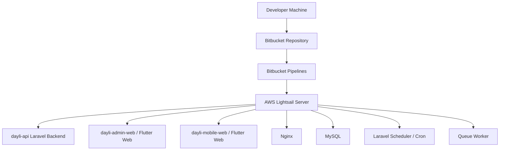
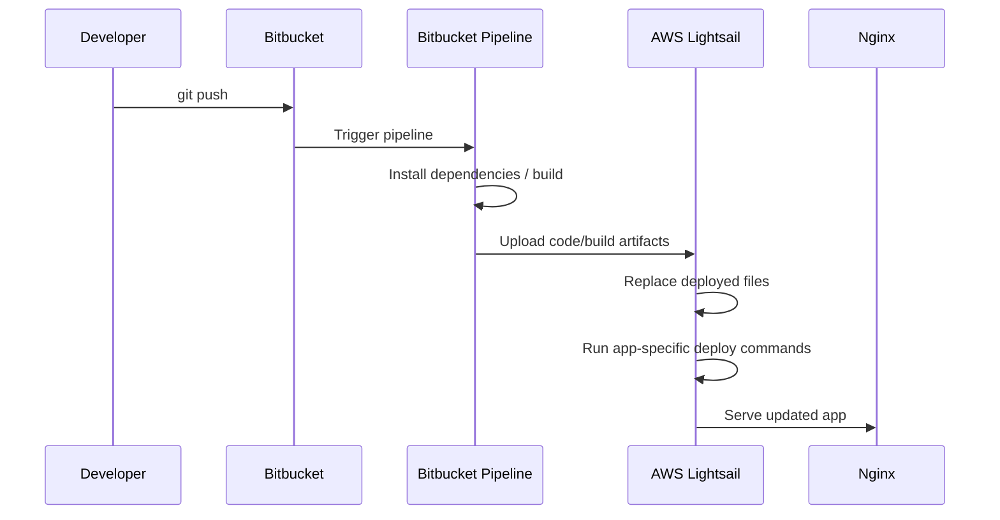
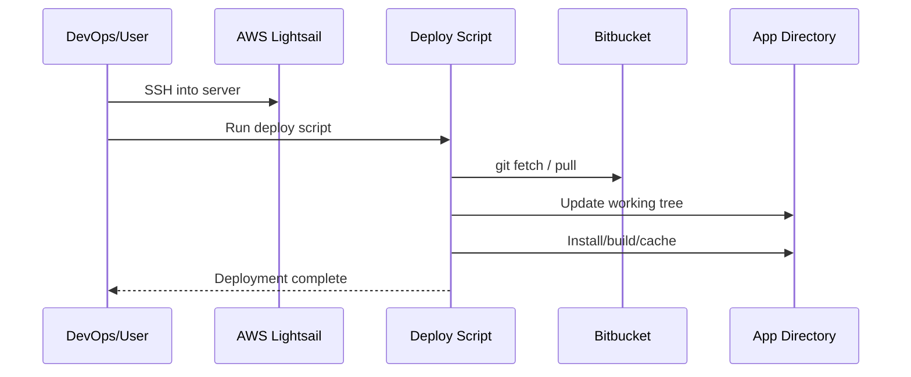

# Dayli DevOps & Deployment Documentation

## 1. Purpose

This document explains the Dayli deployment process.

Dayli currently supports two deployment methods:

```text
1. Bitbucket Pipelines pushing code/build artifacts to AWS Lightsail
2. Server-side deployment scripts pulling code from Bitbucket
```

The second method is useful when Bitbucket build minutes are exhausted or when a quick manual deployment is needed from the server.

---

## 2. Infrastructure Overview



---

## 3. Main Server Components

The AWS Lightsail server hosts:

```text
Laravel API backend
Admin web frontend
Mobile web frontend
MySQL database
Nginx web server
Laravel scheduler
Queue workers
Deployment scripts
```

Typical paths:

```bash
/var/www/dayli-api
/var/www/dayli-admin-web
/var/www/dayli-mobile-web
/home/deploy/deploy-scripts
```

---

# Deployment Method 1: Bitbucket Pipelines Push Deploy

## 4. Purpose

This is the primary automated deployment method.

In this method:

```text
Developer pushes code to Bitbucket
    ↓
Bitbucket Pipeline runs
    ↓
Build happens inside pipeline
    ↓
Artifacts/code are pushed to AWS Lightsail
    ↓
Server is updated
```

---

## 5. Push Deploy Flow



---

## 6. Common Pipeline Responsibilities

Depending on the project, the pipeline may:

### Laravel API

```bash
composer install --no-dev --optimize-autoloader
php artisan migrate --force
php artisan config:cache
php artisan route:cache
php artisan view:cache
php artisan optimize
```

### Flutter Web

```bash
flutter pub get
flutter build web --release --base-href /
```

For mobile web builds, the API base URL may be injected:

```bash
flutter build web \
  --release \
  --base-href / \
  --dart-define=API_BASE=https://api.dayli.in/api
```

---

## 7. Advantages

```text
Automated
Repeatable
Good for normal releases
Build happens outside server
Easy to track from Bitbucket UI
```

---

## 8. Limitations

```text
Consumes Bitbucket build minutes
Pipeline can fail due to repo access / SSH issues
Large builds can be slow
Build logs live in Bitbucket
Manual emergency fixes may still need server access
```

---

# Deployment Method 2: Server Pull Deploy Scripts

## 9. Purpose

This is the fallback/manual deployment method.

Used when:

```text
Bitbucket build minutes are exhausted
Pipeline is failing
Quick manual deployment is needed
Server should pull latest code directly
```

In this method:

```text
SSH into server
    ↓
Run deployment script
    ↓
Script pulls latest code from Bitbucket
    ↓
Script builds/updates project on server
```

---

## 10. Pull Deploy Flow



---

## 11. Deploy Scripts Location

Deployment scripts usually live under:

```bash
/home/deploy/deploy-scripts
```

Example:

```bash
cd ~/deploy-scripts
```

Possible scripts:

```bash
deploy_dayli_api.sh
deploy_dayli_web.sh
deploy_daylimobileapp_web.sh
```

---

## 12. Example Manual Deploy Commands

### Deploy Admin Web

```bash
cd ~/deploy-scripts
./deploy_dayli_web.sh deploy
```

### Deploy Mobile Web

```bash
cd ~/deploy-scripts
./deploy_daylimobileapp_web.sh deploy
```

### Deploy API

```bash
cd ~/deploy-scripts
./deploy_dayli_api.sh deploy
```

---

## 13. Pull Deploy Script Responsibilities

A deployment script typically does:

```text
1. Move to repository/build directory
2. Fetch latest code from Bitbucket
3. Checkout correct branch
4. Install dependencies
5. Build frontend if required
6. Copy build output to /var/www path
7. Set permissions
8. Clear/cache Laravel config if backend
9. Restart services if needed
```

---

# Laravel Backend Deployment

## 14. Laravel Deploy Checklist

For `dayli-api`, a deployment should generally handle:

```bash
composer install --no-dev --optimize-autoloader
php artisan migrate --force
php artisan config:clear
php artisan config:cache
php artisan route:cache
php artisan view:cache
php artisan optimize
```

If queues are running:

```bash
php artisan queue:restart
```

If PHP-FPM is used:

```bash
sudo systemctl reload php8.2-fpm
```

Version may differ depending on server PHP version.

---

## 15. Laravel Directory Structure

Typical backend path:

```bash
/var/www/dayli-api/current
```

Common commands:

```bash
cd /var/www/dayli-api/current
php artisan about
php artisan migrate:status
php artisan schedule:list
```

---

## 16. Laravel Permissions

Storage and cache directories must be writable:

```bash
sudo chown -R www-data:www-data storage bootstrap/cache
sudo chmod -R ug+rw storage bootstrap/cache
```

If using `deploy` user with web group, permissions may vary.

---

# Flutter Web Deployment

## 17. Flutter Web Build

Flutter web projects should be built using:

```bash
flutter pub get
flutter build web --release --base-href /
```

For API base:

```bash
flutter build web \
  --release \
  --base-href / \
  --dart-define=API_BASE=https://api.dayli.in/api
```

---

## 18. Flutter Web Output

Flutter build output is:

```bash
build/web
```

This output is copied to the Nginx web root, such as:

```bash
/var/www/dayli-admin-web
/var/www/dayli-mobile-web
```

---

## 19. Permission Issue Example

If deployment fails with:

```text
mkdir: cannot create directory '/var/www/dayli-mobile-web': Permission denied
```

Fix ownership/permissions:

```bash
sudo mkdir -p /var/www/dayli-mobile-web
sudo chown -R deploy:www-data /var/www/dayli-mobile-web
sudo chmod -R 775 /var/www/dayli-mobile-web
```

---

# Nginx

## 20. Nginx Role

Nginx serves:

```text
API domain
Admin web domain
Mobile web domain
Static Flutter builds
```

Common domains:

```text
api.dayli.in
admin.dayli.in
```

---

## 21. Useful Nginx Commands

```bash
sudo nginx -t
sudo systemctl reload nginx
sudo systemctl status nginx
```

Check logs:

```bash
sudo tail -f /var/log/nginx/error.log
sudo tail -f /var/log/nginx/access.log
```

---

## 22. Common Nginx Issue

Error:

```text
directory index of "/var/www/dayli-admin-web/" is forbidden
```

Meaning:

```text
Nginx is pointing to a directory without index.html
or the build output was not copied correctly.
```

Check:

```bash
ls -la /var/www/dayli-admin-web
```

Expected:

```text
index.html
assets/
main.dart.js
```

---

# Scheduler, Cron & Queue Workers

## 23. Laravel Scheduler

Dayli relies on Laravel scheduler for recurring backend tasks.

Check schedule:

```bash
cd /var/www/dayli-api/current
php artisan schedule:list
```

Run manually:

```bash
php artisan schedule:run
```

Expected scheduled jobs may include:

```text
* * * * * php artisan ops:dispatch-due
0 5 * * * php artisan dayli:generate-daily-orders
```

---

## 24. Cron Entry

Server cron should run Laravel scheduler every minute:

```bash
* * * * * cd /var/www/dayli-api/current && php artisan schedule:run >> /dev/null 2>&1
```

Check crontab:

```bash
crontab -l
```

Edit crontab:

```bash
crontab -e
```

---

## 25. Queue Worker

Run queue worker:

```bash
cd /var/www/dayli-api/current
php artisan queue:work --queue=ops,default -v
```

For production, queue workers should ideally be supervised by Supervisor or systemd.

---

# Database Operations

## 26. MySQL Access

Check databases:

```bash
mysql -u root -p
SHOW DATABASES;
```

Use database:

```sql
USE dayli;
SHOW TABLES;
```

---

## 27. Import Database Dump

If SQL file is UTF-16, MySQL may fail with ASCII null errors.

Check file type:

```bash
file daylidb.sql
```

If output shows UTF-16:

```text
Unicode text, UTF-16, little-endian text
```

Convert:

```bash
iconv -f UTF-16 -t UTF-8 daylidb.sql > daylidb_utf8.sql
```

Import:

```bash
mysql --binary-mode=1 -u root -p dayli < daylidb_utf8.sql
```

---

## 28. Safer Dump from Windows

When dumping locally, prefer UTF-8 output where possible.

Avoid creating UTF-16 SQL files through PowerShell redirection.

---

# Git / Bitbucket Access

## 29. Common Git Error

Error:

```text
Unauthorized
fatal: Could not read from remote repository.
```

Meaning:

```text
Server does not have valid Bitbucket SSH access
or repository permissions are missing.
```

Check:

```bash
ssh -T git@bitbucket.org
```

Check remote:

```bash
git remote -v
```

---

## 30. Deployment Script Git Requirements

Server-side pull deployment requires:

```text
deploy user has SSH key
SSH key added to Bitbucket
repo access granted
correct branch configured
remote URL correct
```

---

# Deployment Verification

## 31. Backend Verification

```bash
cd /var/www/dayli-api/current
php artisan about
php artisan migrate:status
php artisan route:list
```

Check API:

```bash
curl https://api.dayli.in/api/health
```

If no health endpoint exists, use a known safe endpoint.

---

## 32. Frontend Verification

Check files:

```bash
ls -la /var/www/dayli-admin-web
ls -la /var/www/dayli-mobile-web
```

Open:

```text
https://admin.dayli.in
```

Check browser console for:

```text
API_BASE issues
404 assets
CORS errors
```

---

## 33. Scheduler Verification

```bash
php artisan schedule:list
php artisan schedule:run
```

Check whether due tasks run.

---

## 34. Queue Verification

```bash
php artisan queue:work --queue=ops,default -v
```

Check if outbox events process.

---

# Troubleshooting Playbook

## 35. Deployment Failed in Bitbucket

Check:

```text
Pipeline logs
SSH key setup
Server path permissions
Build command
Artifact path
Bitbucket build minutes
```

Fallback:

```text
Use server-side deploy script
```

---

## 36. Server Pull Deploy Failed

Check:

```text
Bitbucket SSH access
git remote URL
branch name
file permissions
disk space
build dependencies
```

Useful commands:

```bash
git status
git fetch origin
git branch
df -h
whoami
```

---

## 37. Site Shows Old Version

Check:

```text
Was build copied to correct /var/www path?
Was browser cache cleared?
Was Nginx reloaded?
Is DNS pointing to correct server?
```

Commands:

```bash
ls -la /var/www/dayli-admin-web
sudo nginx -t
sudo systemctl reload nginx
```

---

## 38. API Errors After Deploy

Check:

```text
.env file
APP_KEY
DB credentials
storage permissions
composer dependencies
migrations
Laravel logs
```

Commands:

```bash
tail -f storage/logs/laravel.log
php artisan config:clear
php artisan config:cache
```

---

## 39. Daily Orders Not Generated

Check:

```text
cron exists
schedule:list shows job
schedule:run works
DOI data is active
logs show command output
```

Manual run:

```bash
php artisan dayli:generate-daily-orders --date=YYYY-MM-DD
```

---

## 40. Events Not Processing

Check:

```sql
SELECT id, event_type, status, attempts, scheduled_at, locked_at
FROM outbox_events
ORDER BY id DESC
LIMIT 20;
```

Then check:

```bash
php artisan ops:dispatch-due
php artisan queue:work --queue=ops,default -v
```

---

# Recommended Deployment Policy

## 41. Normal Deployment

Use:

```text
Bitbucket Pipelines
```

Best for:

```text
regular releases
clean CI/CD
frontend builds
repeatable deployments
```

---

## 42. Fallback Deployment

Use:

```text
server-side deploy scripts
```

Best for:

```text
Bitbucket build minutes exhausted
urgent deployment
pipeline failure
manual controlled deploy
```

---

## 43. Production Safety Rules

Before deploying:

```text
1. Confirm branch
2. Confirm target app
3. Backup DB if migration is risky
4. Check schedule/queue status
5. Deploy
6. Verify app
7. Check logs
```

After deploying:

```text
1. Visit app
2. Test login
3. Test API
4. Check Laravel logs
5. Check queue/outbox if relevant
```

---

# Appendix A: Quick Command Reference

## A1. Server Login

```bash
ssh deploy@SERVER_IP
```

---

## A2. Go to Deploy Scripts

```bash
cd ~/deploy-scripts
ls -la
```

---

## A3. Deploy

```bash
./deploy_dayli_api.sh deploy
./deploy_dayli_web.sh deploy
./deploy_daylimobileapp_web.sh deploy
```

---

## A4. Laravel

```bash
cd /var/www/dayli-api/current
php artisan about
php artisan migrate:status
php artisan schedule:list
php artisan queue:work --queue=ops,default -v
```

---

## A5. Nginx

```bash
sudo nginx -t
sudo systemctl reload nginx
sudo tail -f /var/log/nginx/error.log
```

---

## A6. MySQL

```bash
mysql -u root -p
SHOW DATABASES;
USE dayli;
SHOW TABLES;
```

---

## A7. Git

```bash
git status
git remote -v
git fetch origin
ssh -T git@bitbucket.org
```

---

# Appendix B: Deployment Method Comparison

| Area               | Bitbucket Pipeline Push     | Server Pull Script                  |
| ------------------ | --------------------------- | ----------------------------------- |
| Trigger            | Git push / manual pipeline  | SSH + run script                    |
| Build location     | Bitbucket runner            | Server                              |
| Uses build minutes | Yes                         | No                                  |
| Best for           | Normal releases             | Fallback/manual deploy              |
| Logs               | Bitbucket UI                | Server terminal/logs                |
| Risk               | Pipeline config/SSH failure | Server dependency/permission issues |
| Speed              | Depends on pipeline         | Often faster for small changes      |
| Control            | Automated                   | Manual                              |

---

# Final Summary

Dayli deployment supports two practical modes:

```text
Primary: Bitbucket Pipelines push deploy
Fallback: Server-side pull deploy scripts
```

The server must also run:

```text
Nginx
Laravel Scheduler
Queue Worker
MySQL
```

For production reliability, always verify:

```text
App files
Nginx config
Laravel logs
Cron
Queue worker
Outbox events
```
